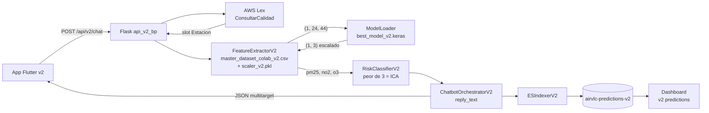

# Plan: Sprint 3 — Backend Flask v2 (multitarget)

## 0. Contexto que arrastramos de Sprint 2

- **Modelo ganador**: `models/modelo_11_v2_Multitarget/best_model_v2.keras` — `LSTM_Attention_Multi`, R² medio 0.8610 (PM2.5 0.8571 · NO₂ 0.8397 · O₃ 0.8861), 148.5 k params. Variante asimétrica disponible: `best_model_v2_asym.keras` (mejor en picos de O₃).
- **Capa custom**: `BahdanauAttention` — el modelo necesita `keras.models.load_model(..., custom_objects={'BahdanauAttention': BahdanauAttention})`.
- **Scaler oficial**: `models/scaler_v2.pkl` con 44 `feature_cols` (incluye PM2.5/NO₂/O₃ + lags 1/3/6/24, rollings 6/12/24h, sin/cos hora/mes, `is_weekend`, `is_fallas`, meteo).
- **Dataset de inferencia**: `data/processed/master_dataset_colab_v2.csv` (194 198 × 45). `feature_extractor_v2` saca de aquí las últimas 24 h por estación y devuelve un tensor `(1, 24, 44)`.
- **El v1 sigue vivo**: rutas `/api/predict`, `/api/risk`, `/api/chat`, `/api/health`, `/api/model/info` (ver [src/api/routes.py](src/api/routes.py)). Sprint 3 **no las toca**: añade `/api/v2/*` en paralelo. Esto mantiene la app Flutter v1 funcional mientras se desarrolla la v2 (Sprint 4).

## 1. Decisiones arquitectónicas para Sprint 3

1. **Coexistencia v1↔v2 en el mismo proceso Flask**: nuevo blueprint `api_v2_bp` con `url_prefix='/api/v2'`. `app.py` registra ambos. La carga de modelos al arranque suma una ruta v2 al `ModelLoader`, sin tocar la lógica v1.
2. **`FeatureExtractor` v2 paralelo, no herencia**: copiar la estructura de [src/api/feature_extractor.py](src/api/feature_extractor.py) y adaptar a 44 features y 3 targets. Más legible que sobrecargar la v1 con flags.
3. **`RiskClassifier` v2 multivariante con criterio ICA**: clasifica PM2.5, NO₂ y O₃ por separado y devuelve el **peor** + desglose. Mantenemos las 4 etiquetas v1 (`bueno/moderado/malo/peligroso`) por compatibilidad de UI.
4. **Predicciones v2 → nuevo índice**: `airvlc-predictions-v2`. Schema extendido con campos `pm25_pred/no2_pred/o3_pred`, riesgo por contaminante y `worst_pollutant`. ES template y Data View nuevos. Reutilizamos `ESIndexer` de v1 con un parámetro `index_name` opcional.
5. **Chatbot v2 enriquecido pero sin retrain de Lex**: mantener intent `ConsultarCalidad`. Cambiar la composición textual del orquestador para narrar los 3 contaminantes y declarar el peor — no necesita rehacer el bot Lex.

## 2. Estructura de la documentación a crear en `docs/v2AirVLCdocs/sprint3/`

Mismo patrón que Sprint 2 (3 ficheros markdown):

- **[`docs/v2AirVLCdocs/sprint3/implementation_plan.md`](docs/v2AirVLCdocs/sprint3/implementation_plan.md)** — el plan con objetivo, decisiones técnicas, contrato de cada nuevo fichero, criterios de aceptación. Cita explícitamente las decisiones 1, 2 y 3 de [docs/v2AirVLCdocs/implementation_plan.md](docs/v2AirVLCdocs/implementation_plan.md) (multivariante, Keras nativo, FE extremo).
- **[`docs/v2AirVLCdocs/sprint3/task.md`](docs/v2AirVLCdocs/sprint3/task.md)** — checklist por bloques (Extractor / RiskClassifier / Orquestador / Rutas / ES / Tests / Demo voz / Cierre).
- **[`docs/v2AirVLCdocs/sprint3/walkthrough.md`](docs/v2AirVLCdocs/sprint3/walkthrough.md)** — stub a rellenar al cierre con métricas de latencia, ejemplos de payload, capturas de los nuevos índices/dashboards.

Los 3 documentos deben enlazar a `sprint2/walkthrough.md` para que cualquier lector entienda de dónde viene el modelo.

## 3. Trabajo de código planificado (lo definimos aquí, no se escribe en este turno)

### 3.1 `src/api/feature_extractor_v2.py` (nuevo)

Espejo de [src/api/feature_extractor.py](src/api/feature_extractor.py) con cambios:

- Carga `data/processed/master_dataset_colab_v2.csv` y `models/scaler_v2.pkl`.
- Lee `feature_cols` directamente del scaler (44 columnas) — nada hardcodeado, así si Sprint 1.x añade features no rompemos.
- `get_features(station)` → `(np.ndarray (1, 24, 44), real_station)`.
- Sustituye `denormalize_pm25` por `inverse_transform_targets(y_norm)` que devuelve `{'pm25': ..., 'no2': ..., 'o3': ...}` reaprovechando la utilidad ya escrita en [src/ml/prepare_dataset_v2.py](src/ml/prepare_dataset_v2.py) → `inverse_transform_targets`.

### 3.2 `src/ml/risk_classifier_v2.py` (nuevo)

Tabla de umbrales por contaminante (propuesta inicial alineada con AQI EU, en µg/m³):

- **PM2.5** (igual que v1): bueno ≤ 12 · moderado ≤ 35.4 · malo ≤ 55.4 · peligroso > 55.4.
- **NO₂** (1 h): bueno ≤ 50 · moderado ≤ 100 · malo ≤ 200 · peligroso > 200.
- **O₃** (1 h): bueno ≤ 100 · moderado ≤ 160 · malo ≤ 240 · peligroso > 240.

API pública:

```python
classify_multi(pm25, no2, o3, station=None) -> {
    'pollutants': {'pm25': {...}, 'no2': {...}, 'o3': {...}},  # cada uno con level/color/emoji/value
    'worst': {'pollutant': 'no2', 'level': 'malo', ...},
    'reply_text': "El ICA es MALO por NO₂ (143 µg/m³). PM2.5 y O₃ están normales.",
    'station': '...',
}
```

Reutiliza el dict `RISK_LEVELS` de [src/ml/risk_classifier.py](src/ml/risk_classifier.py) pero parametriza los rangos por contaminante.

### 3.3 `src/api/model_loader.py` (modificación pequeña)

Añadir entrada al `priority_models` para v2 (sin tocar las de v1) y permitir consulta `loader.get_model('LSTM_Attention_Multi')`. Pasar `custom_objects={'BahdanauAttention': BahdanauAttention}` al `keras.models.load_model` solo para las claves v2. Definir `BahdanauAttention` en un módulo nuevo `src/api/_keras_custom.py` para que pueda importarse desde aquí sin depender de TensorFlow al cargar el módulo.

### 3.4 `src/api/routes_v2.py` (nuevo, blueprint dedicado)

Cuatro rutas, todas bajo `/api/v2`:

- `GET /api/v2/health` — `service: airvlc-v2`, lista de modelos cargados, contadores de docs en `airvlc-predictions-v2`.
- `POST /api/v2/predict` — body `{'station': 'Politécnico'}` o `{'features': [[...]]}` (compatible con v1). Respuesta:
  ```json
  {
    "success": true,
    "station": "Politécnico",
    "predictions": {"pm25": 14.2, "no2": 38.1, "o3": 71.7, "unit": "µg/m³"},
    "model_used": "LSTM_Attention_Multi",
    "timestamp": "..."
  }
  ```
- `POST /api/v2/risk` — input igual que `/api/v2/predict`. Respuesta = output de `classify_multi`. Side-effect: indexa en `airvlc-predictions-v2`.
- `POST /api/v2/chat` — recibe `{message, session_id}`, llama al nuevo `ChatbotOrchestratorV2`, devuelve la respuesta enriquecida.

### 3.5 `src/services/chatbot_orchestrator_v2.py` (nuevo)

Espejo de [src/services/chatbot_orchestrator.py](src/services/chatbot_orchestrator.py) con cambios:

- Sigue usando `LexService` con la misma intent `ConsultarCalidad` (no hay que reentrenar Lex).
- Tras predecir los 3 valores, llama a `RiskClassifierV2.classify_multi`.
- Genera `reply_text` ya formado por el clasificador. La respuesta JSON añade `pollutants` y `worst` para que la app Flutter v2 lo pinte.
- Mantiene los caminos de error / slot faltante / fallback idénticos a v1.

### 3.6 `src/api/es_indexer.py` (modificación mínima)

`ESIndexer.__init__` ya acepta `index_name`. Sprint 3 introduce un segundo indexer en `app.py` con `index_name='airvlc-predictions-v2'`. Extender `_build_document` para incluir los nuevos campos `pm25_pred/no2_pred/o3_pred/risk_pm25/risk_no2/risk_o3/worst_pollutant/worst_level`. Si el campo no llega, no lo escribe (mantiene compatibilidad v1).

### 3.7 ES template + Data View v2

- `docker/elasticsearch/templates/airvlc-predictions-v2.json` (nuevo) o un script Python en `src/scripts/setup_es_predictions_v2.py` que haga `PUT _index_template/airvlc-predictions-v2`.
- `src/scripts/setup_kibana_v2_predictions_dataview.py` que crea el Data View `dv-airvlc-predictions-v2` y un dashboard mínimo (3 KPIs en vivo: % "malo o peor" por contaminante en últimas 24 h, mapa de estaciones coloreadas por nivel ICA, tabla de últimas predicciones).

### 3.8 `app.py` (modificación)

- Importar y registrar el `api_v2_bp`.
- Cargar el modelo v2 con custom_objects.
- Construir un segundo `ESIndexer` para `airvlc-predictions-v2` y guardarlo en `app.config['ES_INDEXER_V2']`.
- No eliminar nada de v1.

### 3.9 Tests (nuevo `tests/api/`)

Sprint 3 introduce el primer paquete de tests del backend (no había). Pytest + Flask test client:

- `tests/api/test_v2_predict.py` — fake `ModelLoader` que devuelve un tensor 1×3 conocido y verifica que el JSON respeta el contrato.
- `tests/api/test_v2_risk.py` — verifica los 4 niveles para cada contaminante y la elección del peor.
- `tests/api/test_v2_chat.py` — mockea `LexService` y comprueba el `reply_text` multitarget.
- `tests/api/test_v1_unchanged.py` — smoke test que `/api/predict` y `/api/risk` v1 siguen respondiendo igual.

### 3.10 Demo de voz v2 (opcional, ligero)

Añadir `src/services/aws/demo_voice_flow_v2.py` que llama a `/api/v2/risk` y narra con Polly el `reply_text` multitarget. No bloquea el sprint, sirve como demo final.

## 4. Diagrama del flujo v2 que cuajamos en Sprint 3



## 5. Criterios de aceptación de Sprint 3

- [ ] `curl -X POST localhost:5001/api/v2/predict -d '{"station":"Politécnico"}'` devuelve los 3 valores en µg/m³ y `model_used == "LSTM_Attention_Multi"`.
- [ ] `curl -X POST localhost:5001/api/v2/risk` devuelve `worst.pollutant ∈ {pm25,no2,o3}` y un `reply_text` que nombra explícitamente los 3 contaminantes.
- [ ] `airvlc-predictions-v2` tiene al menos 1 doc por estación tras 1 minuto de uso continuo.
- [ ] `/api/predict`, `/api/risk`, `/api/chat` v1 siguen respondiendo idénticos a antes (regresión cero).
- [ ] Latencia p95 de `/api/v2/risk` < 350 ms en M1/M2 (vs ~250 ms de v1; el modelo es solo 17 % más grande).
- [ ] `pytest tests/api/` pasa en verde.

## 6. Riesgos y mitigaciones (anticipados)

- **`BahdanauAttention` no carga**: si `keras.models.load_model` falla, montar el modelo desde `models/modelo_11_v2_Multitarget/training_history.json` + pesos. Mitigación: el módulo `_keras_custom.py` será probado en isolation antes de tocar `app.py`.
- **CSV de 66 MB cargado en memoria al arrancar**: aceptable por ahora (`FeatureExtractor` lo hace una vez por proceso). Si molesta, futuro Sprint 3.x meterá una caché Redis con clave `last_features:{estacion}`.
- **Umbrales NO₂/O₃**: la propuesta es razonable pero se puede ajustar tras consultar la NTP/AEMET. El plan deja la tabla configurable en `RISK_LEVELS_V2` para iterar sin tocar la lógica.

## 7. Salida de este plan

Cuando apruebes, en modo agente generaré exclusivamente los 3 markdowns de `docs/v2AirVLCdocs/sprint3/` (sin tocar código). Después, en una tanda separada, implementaríamos los ficheros `*_v2.py` siguiendo este contrato.