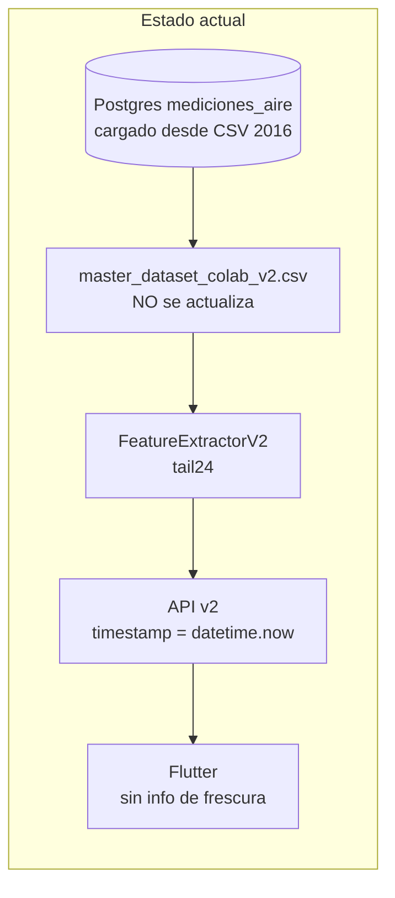
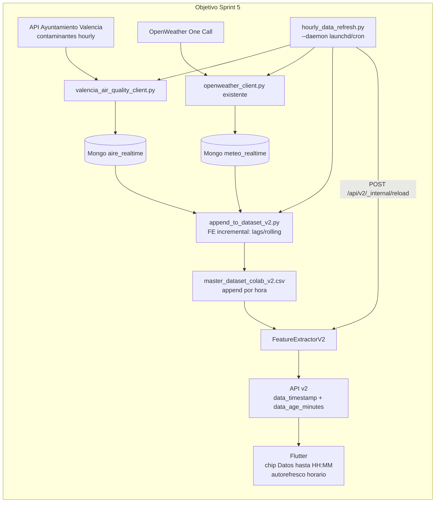

# Sprint 5 - Data Freshness y Refresco Horario

## Objetivo

Pasar el modelo de "predicción sobre dataset estático" a "predicción sobre datos refrescados cada hora", manteniendo coherencia con los sensores reales del Ayuntamiento de Valencia que entrenaron el modelo. Mostrar al usuario claramente la antigüedad de los datos y refrescar automáticamente cada hora en la app.

Decisiones tomadas (ver respuestas previas):
- Fuente de contaminantes: datos abiertos Ayuntamiento de Valencia (sensores reales).
- Scheduler: script externo independiente (`launchd` en macOS / `cron` en server) siguiendo el patrón `--daemon` ya usado en `sync_meteo_to_es.py`.
- AEMET diario se mantiene como histórico de referencia (no se usa para refresco horario porque es diario, no horario).
- OpenWeather One Call 3.0 ya está integrado, lo reutilizamos para meteo horaria.

## Sobre tu pregunta "OpenWeather es suficiente?"

No. Para meteo (T, viento, humedad, precipitación) sí. Para PM2.5/NO2/O3 no, porque la `Air Pollution API` de OpenWeather **no son los sensores del Ayuntamiento** que entrenaron tu modelo. Por eso vamos por la API municipal: mantenemos la coherencia con `mediciones_aire` (Postgres) y con tu CSV v2.

## Mismatch que estamos resolviendo





## Fase A. Backend: exponer frescura de datos (rápido, valor inmediato)

Cambios mínimos para que la app ya pueda mostrar "datos hasta HH:MM" antes incluso de tocar el pipeline.

- [src/api/feature_extractor_v2.py](src/api/feature_extractor_v2.py): cambiar la firma de `get_features` para devolver también el timestamp de la última fila usada.

```python
def get_features(self, station_name: str) -> Tuple[np.ndarray, str, dict]:
    df_station = ...
    df_last_24h = df_station.tail(24).copy()
    last_ts = pd.to_datetime(df_last_24h["fecha"].iloc[-1])
    first_ts = pd.to_datetime(df_last_24h["fecha"].iloc[0])
    meta = {
        "data_timestamp": last_ts.isoformat(),
        "data_window_start": first_ts.isoformat(),
        "data_age_minutes": int((datetime.now() - last_ts).total_seconds() // 60),
    }
    return final_features, real_station, meta
```

- [src/api/routes_v2.py](src/api/routes_v2.py): incluir `meta` en las respuestas de `/api/v2/predict`, `/api/v2/risk` y `/api/v2/chat`. Distinguir claramente:
  - `server_timestamp` (cuándo respondió el backend, lo actual `datetime.now()`).
  - `data_timestamp` (última fila del CSV usada).
  - `data_age_minutes`.

## Fase B. Backend: pipeline de ingesta horaria

### B.1 Nuevo cliente Valencia Open Data

Nuevo archivo `src/ingestion/valencia_air_quality_client.py`:
- Endpoint: API Opendatasoft del Ayuntamiento (parametrizable por env `VALENCIA_AIR_API_URL`, dataset `rvffqsfu6dataire` o equivalente; lo configuramos sin hardcodear).
- Descarga las mediciones recientes (1h o las últimas N horas), normaliza nombres de estación al canónico ya usado en el CSV v2 (mismo `lex_to_station` de [src/api/feature_extractor_v2.py](src/api/feature_extractor_v2.py)).
- Guarda upsert idempotente en Mongo `airvlc_db.aire_realtime` con clave `{estacion, fecha_iso}` (evita duplicados si se vuelve a ejecutar).

### B.2 Append incremental al CSV v2

Nuevo archivo `src/ml/append_to_dataset_v2.py`:
- Para cada estación con dato nuevo:
  1. Lee la cola de [data/processed/master_dataset_colab_v2.csv](data/processed/master_dataset_colab_v2.csv) (últimas 48h por estación, suficiente para lag24 y rolling24h).
  2. Cruza la nueva fila horaria (contaminantes desde Mongo `aire_realtime` + meteo desde Mongo `meteo_realtime` o último valor disponible).
  3. Recalcula los features de esa fila: `pm25_lag1/3/6/24`, `*_rolling_6h/12h/24h`, `hora_del_dia`, trig, `is_weekend`, `is_fallas`, one-hot `station_*`.
  4. Hace `df.to_csv(..., mode='a', header=False)` (append).
- Tabla de origen → destino sin recalcular todo el dataset (mucho más rápido y seguro).

Imports clave a reutilizar de [src/ml/prepare_colab_dataset_v2.py](src/ml/prepare_colab_dataset_v2.py): `LAGS`, `ROLLING_WINDOWS`, `TARGETS`.

### B.3 Scheduler externo

Nuevo archivo `src/scripts/hourly_data_refresh.py` siguiendo el patrón ya existente de [src/scripts/sync_meteo_to_es.py](src/scripts/sync_meteo_to_es.py):

```python
def run_once():
    fetch_valencia_air_quality()        # B.1
    fetch_openweather_realtime()        # ya existe
    append_to_dataset_v2()              # B.2
    notify_api_reload()                 # POST /api/v2/_internal/reload

def run_daemon(interval_seconds=3600):
    while True:
        next_top = ((datetime.now() + timedelta(hours=1))
                    .replace(minute=2, second=0, microsecond=0))
        run_once()
        time.sleep((next_top - datetime.now()).total_seconds())
```

- Modo de uso:
  - `python src/scripts/hourly_data_refresh.py --once` (manual / debug).
  - `python src/scripts/hourly_data_refresh.py --daemon` (proceso persistente).
- macOS: añadiremos un `.plist` ejemplo en `docs/v2AirVLCdocs/sprint5/launchd/com.airvlc.hourly_refresh.plist` para `launchctl load`.

### B.4 Endpoint interno de recarga

[src/api/routes_v2.py](src/api/routes_v2.py): nuevo `POST /api/v2/_internal/reload` (protegido con header `X-Internal-Token` configurable por env). Hace `app.config['FEATURE_EXTRACTOR_V2'].reload()` que vuelve a leer el CSV en memoria. Evita reiniciar Flask cada hora.

## Fase C. Flutter: visualización + autorefresco

### C.1 Modelo de datos

`app/lib/core/models/prediction.dart`:
```dart
class Prediction {
  final double pm25;
  final double no2;
  final double o3;
  final DateTime serverTimestamp;
  final DateTime dataTimestamp;       // NUEVO
  final int dataAgeMinutes;           // NUEVO
  final DateTime dataWindowStart;     // NUEVO
  ...
}
```

### C.2 Chip de frescura

Nuevo widget `app/lib/features/dashboard/widgets/freshness_chip.dart`:
- Texto: "Datos hasta 12:00 - hace 17 min".
- Color: verde si `<90 min`, ámbar `90-180 min`, rojo `>180 min`.
- Subtítulo: "Próxima actualización ~HH:00".

Se inserta en el `Dashboard` (encima de las 3 cards PM2.5/NO2/O3 ya planificadas en Sprint 4).

### C.3 Autorefresco horario

`app/lib/core/services/refresh_scheduler.dart`:
- `Timer.periodic(Duration(minutes: 1))` que mira si `DateTime.now().hour != lastRefresh.hour` o si `dataAgeMinutes > 70`. Si sí, dispara recarga.
- Pull-to-refresh manual también disponible (`RefreshIndicator`).
- Spinner discreto en el chip mientras refresca.
- Si la app se reanuda (`AppLifecycleState.resumed`), forzamos un check inmediato.

### C.4 Configuración

Nada nuevo: sigue usando `--dart-define=AIRVLC_BASE_URL=...` ya existente.

## Fase D. Tests, docs y operación

- Tests:
  - `tests/api/test_v2_data_freshness.py`: payloads de `/predict` y `/risk` incluyen `data_timestamp` y `data_age_minutes` y son consistentes (data_age_minutes >= 0).
  - `tests/ingestion/test_valencia_client.py`: parser idempotente con un fixture JSON.
  - `tests/ml/test_append_to_dataset_v2.py`: dado un CSV de 48h y una nueva fila, el append calcula correctamente `lag1`, `lag24` y `rolling_24h`.
  - `app/test/freshness_chip_test.dart`: 3 ramas de color según `dataAgeMinutes`.

- Docs nuevas en `docs/v2AirVLCdocs/sprint5/`:
  - `implementation_plan.md` (este plan resumido).
  - `task.md` (checklist).
  - `walkthrough.md` (capturas + tiempos reales).
  - `data_pipeline_setup.md` (variables de entorno: `VALENCIA_AIR_API_URL`, `OPENWEATHER_API_KEY`, `AIRVLC_INTERNAL_RELOAD_TOKEN`; instrucciones `launchctl load` y troubleshooting).
  - `launchd/com.airvlc.hourly_refresh.plist` (plantilla).
  - Actualizar [docs/v2AirVLCdocs/task_sprints.md](docs/v2AirVLCdocs/task_sprints.md) añadiendo el Sprint 5.

- Operativa:
  - El cron tira a `~/airvlc_logs/hourly_refresh.log`.
  - El backend Flask sigue arrancando independientemente; si el cron está caído, `data_age_minutes` crecerá y la app pintará el chip en rojo (degradación visible para el usuario, no caída).

## Por qué este plan no obliga a reentrenar el modelo

El modelo `LSTM_Attention_Multi` recibe siempre `(1, 24, 44)` features escaladas con el mismo `scaler_v2.pkl`. Mientras las nuevas filas tengan los mismos 44 features y se respeten los rangos de entrenamiento (escalado MinMax tolera valores cercanos), no hay drift inmediato. Reentrenar quedaría para un Sprint 6 cuando tengamos suficiente histórico nuevo (ej. 3 meses de datos refrescados).