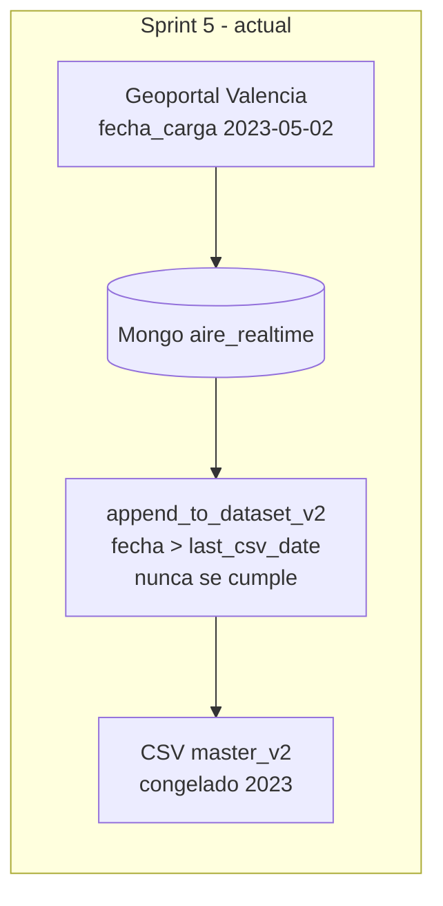
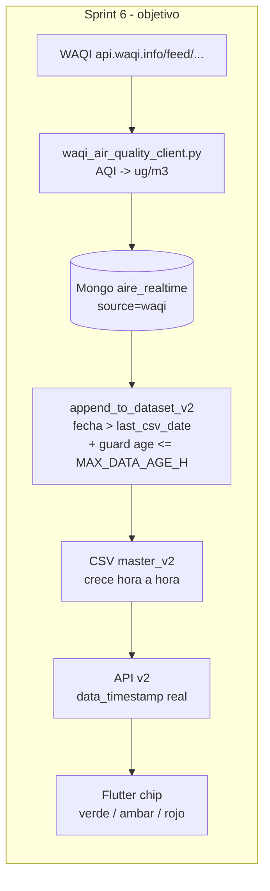

# Sprint 6 - Pollutants en vivo via WAQI + politica truthful

## Punto de partida

- Sprint 5 funciona: pipeline horario, app con chip de frescura, endpoint `/api/v2/_internal/reload`.
- Pero el Paso 1 esta tirando del Geoportal Valencia (`estatautomaticas.json`), que esta **congelado en mayo 2023** (`fecha_carga: 20230502...`).
- Resultado actual: `inserted: 0, modified: 4` en Mongo, `Sin datos nuevos` en append y CSV bloqueado en `2023-05-02 11:20:13`.

Decisiones (preguntas previas):
- Fuente live: WAQI (aqicn.org) - gratis con token, refleja sensores oficiales de Valencia.
- Politica de append: truthful - solo crecer el CSV con datos realmente nuevos; la app ya pinta la edad real.

## Diagrama del cambio





## Fase A. Cliente WAQI

Nuevo archivo `src/ingestion/waqi_air_quality_client.py` (paralelo al actual `valencia_air_quality_client.py`, no lo borramos por si volvemos a Geoportal en el futuro):

- Lee `WAQI_TOKEN` de env (`os.getenv("WAQI_TOKEN")`). Si falta, error claro como hicimos con OpenWeather.
- Llama a WAQI por estacion: `GET https://api.waqi.info/feed/@{uid}/?token=...` o `GET https://api.waqi.info/feed/{slug}/?token=...`.
- Extrae `data.iaqi.pm25.v / no2.v / o3.v` y `data.time.iso`.
- Convierte AQI -> ug/m3 con breakpoints EPA (funcion `aqi_to_concentration(pollutant, aqi)`):
  - PM2.5: `0-50 -> 0.0-12.0`, `51-100 -> 12.1-35.4`, `101-150 -> 35.5-55.4`, ...
  - NO2 (1h, ppb): tabla EPA, despues `* 1.88` para pasar a ug/m3.
  - O3 (8h, ppb): tabla EPA, despues `* 1.96` para pasar a ug/m3.
- Si WAQI ya devuelve concentracion en `iaqi.pm25.v` (algunas estaciones europeas si lo dan en ug/m3), incluir flag/parametro.
- Hace upsert en Mongo `airvlc_db.aire_realtime` con la misma clave `{estacion, fecha_iso}` que el cliente actual.
- Marca `source: "waqi"` para distinguirlo del Geoportal.

Firma esperada: `fetch_waqi_air_quality(hours: int = 6) -> dict` con el mismo shape que el cliente actual: `{raw, parsed, inserted, modified, errors}`.

## Fase B. Descubrimiento + mapeo de estaciones

WAQI no usa los mismos nombres que tu CSV. Hace falta resolver una vez el UID/slug por estacion canonica.

Nuevo script `src/scripts/discover_waqi_stations.py`:
- Llama `GET https://api.waqi.info/search/?keyword=Valencia&token=...`.
- Tambien llama `GET https://api.waqi.info/map/bounds/?latlng=39.4,-0.5,39.55,-0.25&token=...` (bbox Valencia).
- Imprime tabla: WAQI name, uid, lat, lon.
- Cruza con las coords ya existentes en [src/api/routes_v2.py](src/api/routes_v2.py) (`STATION_COORDS` del Sprint 4) y elige la WAQI mas cercana por haversine simple.
- Output: bloque Python listo para pegar en el cliente como `WAQI_STATION_MAP`:

```python
WAQI_STATION_MAP = {
    "Francia": {"uid": 12345, "waqi_name": "Avda. Francia, Valencia"},
    "Universidad Politecnica": {"uid": ..., "waqi_name": ...},
    "Moli del Sol": {...},
    "Pista de Silla": {...},
    "Puerto Valencia": {...},
    "Puerto Moll Trans. Ponent": {...},
    "Puerto llit antic Turia": {...},
}
```

Si alguna estacion no esta en WAQI, el cliente la salta con `skipped` y la app simplemente la marca como sin datos frescos (chip rojo).

## Fase C. Guard de staleness en append

Editar [src/ml/append_to_dataset_v2.py](src/ml/append_to_dataset_v2.py):

- Anadir constante `MAX_DATA_AGE_HOURS = int(os.getenv("AIRVLC_MAX_DATA_AGE_H", "6"))`.
- Tras leer `df_new_air` desde Mongo, filtrar:

```python
now_utc = datetime.now(timezone.utc)
ages = (now_utc - df_new_air["fecha"]).dt.total_seconds() / 3600
df_new_air = df_new_air[ages <= MAX_DATA_AGE_HOURS]
```

- Logear cuantas filas se descartan por staleness.
- Resultado: si WAQI cae o si todos los datos son viejos, el CSV no se ensucia y la app pinta el chip rojo coherentemente.

## Fase D. Wiring del orquestador

Editar [src/scripts/hourly_data_refresh.py](src/scripts/hourly_data_refresh.py):

- Reemplazar el `from src.ingestion.valencia_air_quality_client import fetch_valencia_air_quality` por `from src.ingestion.waqi_air_quality_client import fetch_waqi_air_quality`.
- Mantener una env opcional `AIRVLC_AIR_SOURCE` (`waqi` por defecto, `geoportal` opcional) por si en el futuro vuelve el Geoportal a estar vivo, sin romper retrocompatibilidad.

```python
source = os.getenv("AIRVLC_AIR_SOURCE", "waqi").lower()
if source == "waqi":
    from src.ingestion.waqi_air_quality_client import fetch_waqi_air_quality as fetch_air
elif source == "geoportal":
    from src.ingestion.valencia_air_quality_client import fetch_valencia_air_quality as fetch_air
result = fetch_air(hours=6)
```

## Fase E. Tests, docs y operativa

Tests:
- `tests/ingestion/test_waqi_client.py`:
  - Mock de respuesta WAQI con `iaqi.pm25.v=55, time.iso=...` y verificar conversion AQI -> ug/m3.
  - Test de mapeo: `Francia` -> uid esperado.
  - Idempotencia upsert (dos llamadas no duplican).
- `tests/ingestion/test_aqi_conversion.py`:
  - Casos limite: AQI=50 -> 12.0 ug/m3 PM2.5, AQI=100 -> 35.4 ug/m3, etc.
- `tests/ml/test_append_freshness_guard.py`:
  - Mongo con 1 fila de hace 2h (entra) y 1 de hace 24h (no entra).

Docs en `docs/v2AirVLCdocs/sprint6/`:
- `implementation_plan.md` (resumen de este plan).
- `task.md` (checklist).
- `walkthrough.md` (capturas: WAQI dashboard, log del pipeline con `inserted >= 1`, app con chip verde y `data_timestamp` reciente).
- `data_pipeline_setup.md`:
  - Como sacar `WAQI_TOKEN` (registro en `https://aqicn.org/data-platform/token/`).
  - Variables nuevas: `WAQI_TOKEN`, `AIRVLC_AIR_SOURCE` (opcional, default `waqi`), `AIRVLC_MAX_DATA_AGE_H` (opcional, default `6`).
  - Tabla del `WAQI_STATION_MAP` final (resultado del script de descubrimiento).
- Actualizar [docs/v2AirVLCdocs/task_sprints.md](docs/v2AirVLCdocs/task_sprints.md) anadiendo el Sprint 6.

Operativa:
- Si WAQI cae: el guard de staleness asegura que el CSV no se contamine, la API devuelve `data_age_minutes` creciente y la app pinta rojo. Sin sorpresas.
- Si WAQI marca alguna estacion como `-` (sin medicion en esa hora), el cliente la salta y la app pinta esa estacion en rojo individual.

## Por que no hace falta reentrenar (igual que Sprint 5)

El modelo sigue recibiendo `(1, 24, 44)` con el mismo `scaler_v2.pkl`. WAQI nos da los mismos 3 contaminantes (`pm25`, `no2`, `o3`) en `ug/m3` (tras la conversion), que es exactamente lo que el modelo espera. El cambio es de fuente, no de feature space.