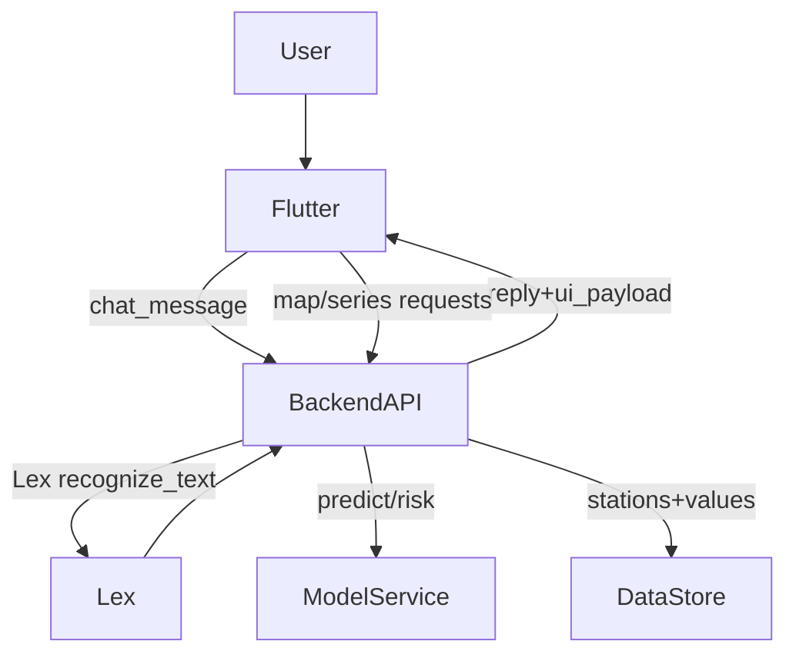

# Sprint 7 — Visualizaciones + Chatbot “con vida” (mapa heatmap + forecast 24–72h)

## Objetivo del sprint
- **Hacer la app útil y fiable**: que el usuario entienda rápido la situación (ahora) y el riesgo estimado (24–72h) por estación/contaminante.
- **Dar “vida” al chatbot**: no solo texto; que dispare **vistas** (mapa, serie temporal, comparación) alineadas con intents.
- **Transparencia del modelo**: mostrar incertidumbre/limitaciones y evitar claims tipo “trayectoria/recorrido” si no hay modelado físico.

## Crítica a tus propuestas (y ajustes recomendados)
- **“Mapa del recorrido del contaminante”**: con la decisión `heatmap_only`, mejor reformularlo como **“mapa de distribución”** o **“mapa de niveles por estación”**. Hablar de “recorrido” sugiere causalidad y dinámica atmosférica (viento/dispersion) que el sistema no está modelando.
- **“Predecir X días o X semanas”**: muy buena idea, pero para confianza de usuario y demo sólida, el sprint debería enfocarse en **24–72h**. Semanas suele degradar mucho y te obliga a explicar demasiada incertidumbre.
- **Kibana con última predicción**: es útil para ti (monitorización), pero **no es el core UX** del usuario final. En Sprint 7 lo pondría como “operacional” (para validar el pipeline) y el valor user-facing en Flutter.

## Opinión sincera y transparente del modelo (basado en `day11_v2_results.csv`)
Archivo: [models/modelo_11_v2_Multitarget/day11_v2_results.csv](/Users/miguel/Desktop/Curso IA/Propuesta Proyecto/AirVLCProyecto/models/modelo_11_v2_Multitarget/day11_v2_results.csv)
- **Mejor arquitectura**: `LSTM_Attention_Multi`.
- **Rendimiento (R²)**:
  - **pm25**: 0.857
  - **no2**: 0.840
  - **o3**: 0.886
- **Errores (RMSE)**:
  - **pm25**: 2.83
  - **no2**: 5.91
  - **o3**: 8.88
- **Lectura honesta**:
  - Son **buenos R²** (explican gran parte de la variación), especialmente en `o3`.
  - Aun así, el RMSE indica que habrá días/estaciones donde la predicción **se desvíe varios puntos**; esto se nota más cuando el contaminante está alto (errores absolutos más visibles).
  - Para presentación: el modelo es **válido para tendencia/alerta y comparación relativa**, pero no debe venderse como “valor exacto garantizado”.
- **Implicación para UI**: enseñar **banda de confianza simple** (p.ej. “baja/media/alta confianza” basada en freshness y variabilidad reciente) o al menos un **disclaimer contextual**.

## UX propuesto en Flutter (visualizaciones)
- **Pantalla Mapa (Heatmap por estaciones)**
  - Capa principal: **puntos por estación** (marker) con color por **nivel de riesgo** (no por valor crudo), para que sea interpretable.
  - Controles:
    - selector `Contaminante` (pm25/no2/o3)
    - selector `Momento`: Ahora / +24h / +48h / +72h
    - filtro “solo estaciones con riesgo Alto”
  - Al tocar estación: bottom sheet con **mini-serie** (últimas 24–72h) + **forecast 24–72h**.

- **Pantalla Serie temporal (Estación + contaminante)**
  - 2 líneas: **observado** (si existe) y **predicho** (forecast), con leyenda clara.
  - Chips de “freshness” (dato reciente vs antiguo) para que el usuario sepa si está viendo algo confiable.

- **Pantalla Comparación (2 estaciones)**
  - Gráfico simple: barras o líneas superpuestas de riesgo a 24/48/72h.
  - Conclusión textual breve (“mejor para correr/pasear”) usando la intent `ConsejoSalud`.

## Chatbot “con vida” (Lex + orquestación)
Referencia intents actuales: [docs/v2AirVLCdocs/sprint4/aws_keys_setup.md](/Users/miguel/Desktop/Curso IA/Propuesta Proyecto/AirVLCProyecto/docs/v2AirVLCdocs/sprint4/aws_keys_setup.md)
- Mantener intents existentes y añadir **respuesta estructurada** desde backend para que Flutter renderice tarjetas:
  - `ConsultarContaminante` → devolver `action=open_station_detail` + `station_id` + `pollutant` + `horizon=now|24|48|72`.
  - `CompararEstaciones` → `action=open_comparison`.
  - `ConsejoSalud` → `action=open_advice` y, opcionalmente, CTA “ver mapa”.

- Nuevas intents sugeridas (mínimas y de alto valor)
  - **`VerMapaRiesgo`** (sin slots o con `Contaminante` opcional): “muéstrame el mapa del riesgo de {Contaminante}”.
  - **`PrevisionRiesgo`** (slots: `Estacion`, `Contaminante`, `Horizonte`=24/48/72): “cómo estará el {Contaminante} en {Estacion} en 48 horas”.
  - (Opcional) **`TopPeoresEstaciones`** (slots: `Contaminante`, `Horizonte`): “cuáles están peor en 72h”. Esto alimenta una lista + CTA a mapa.

## Backend/API (contratos necesarios)
- Endpoint para mapa: “dame estaciones + riesgo/value para un contaminante en un horizonte”.
- Endpoint para serie temporal: “dame histórico reciente + forecast 24–72h para estación/contaminante”.
- Endpoint para ranking: “top N estaciones por riesgo en horizonte”.
- Ajuste en `/api/v2/chat`: además de `reply`, devolver `ui_payload` (acción + parámetros) para que Flutter pueda navegar/renderizar.

## Kibana (operacional)
- Añadir/ajustar dashboard “última predicción” como verificación de pipeline y demo técnica.
- Enfocar en:
  - timestamp de última inferencia
  - conteo de estaciones predichas
  - distribución de riesgo por contaminante

## Métricas de éxito (definición de “útil”)
- En 2 taps o 1 mensaje de chat, el usuario llega a:
  - mapa de riesgo por contaminante
  - detalle de estación con forecast 24–72h
- Claridad: siempre se ve `Momento` (Ahora/+24/+48/+72) y `Contaminante`.
- Transparencia: badge/aviso cuando datos no están frescos o forecast se basa en datos incompletos.

## Diagrama (alto nivel)

