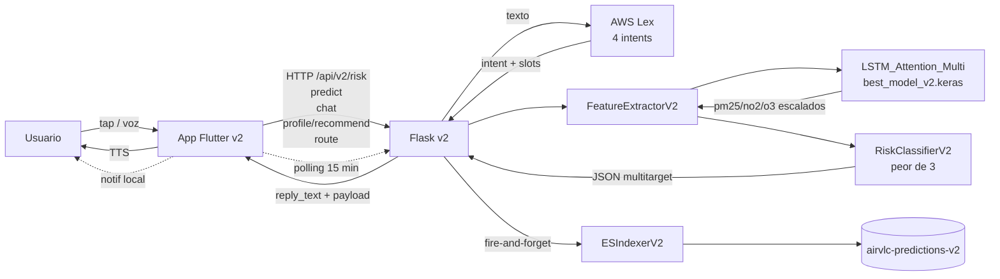

# Sprint 4 — App Flutter v2 (multitarget + diferencial)

## 0. Cierre del Sprint 3 (lo que ya tenemos en producción local)

- **Backend Flask v2 funcionando** (validado el 6 de mayo). Rutas en paralelo a v1:
  - `GET /api/v2/health`, `POST /api/v2/predict`, `POST /api/v2/risk`, `POST /api/v2/chat` (ver [src/api/routes_v2.py](src/api/routes_v2.py)).
- **Modelo activo**: `LSTM_Attention_Multi` cargado desde `models/modelo_11_v2_Multitarget/best_model_v2.keras` con `BahdanauAttention` (ver [src/api/_keras_custom.py](src/api/_keras_custom.py) y [src/api/model_loader.py](src/api/model_loader.py)).
- **Extractor v2 multitarget**: `models/scaler_v2.pkl` (formato dict con 44 `feature_cols`) + `data/processed/master_dataset_colab_v2.csv` (estaciones reales: Francia, Molí del Sol, Pista de Silla, Puerto Moll Trans. Ponent, Puerto Valencia, Puerto llit antic Túria, Universidad Politécnica). Implementado en [src/api/feature_extractor_v2.py](src/api/feature_extractor_v2.py).
- **Riesgo ICA-style**: peor de PM2.5/NO₂/O₃ con `reply_text` narrativo en [src/ml/risk_classifier_v2.py](src/ml/risk_classifier_v2.py).
- **Indexación ES v2**: `airvlc-predictions-v2` (Data View `dv-airvlc-predictions-v2` ya creado en Kibana).
- **Tests verdes**: `pytest -q tests/api` → 4 passed.
- **Métrica de salida del modelo (Sprint 2)**: R² medio 0.86 (PM2.5 0.857 / NO₂ 0.840 / O₃ 0.886) — mejora −40% MAE PM2.5 vs v1.

> Cómo arrancar la API a partir de ahora: `./venv/bin/python src/api/app.py`. **Nunca** lanzar con `python3` pelado (es el del sistema y no tiene TF/pandas).

## 1. Objetivo del Sprint 4

Pasar de "modelo + API" a **producto real, usable y diferencial** en mano del ciudadano. La app Flutter no debe limitarse a "ver la predicción", sino:

1. **Personalizar la recomendación** con el perfil de salud del usuario.
2. **Ayudar a tomar decisiones reales**: ruta más saludable, ¿salgo a correr?, ¿abro la ventana?
3. **Avisar de forma proactiva** cuando la calidad cambia (alertas suscritas).
4. **Funcionar manos libres** (voz extremo a extremo: Transcribe → Lex → Flask → Polly).
5. **Comparar estaciones temporalmente** dentro de la app, no solo en Kibana.

Plataformas objetivo: **iOS y Android**.

## 2. Recordatorio crítico (para el README de Sprint 4 en docs)

> **Antes de arrancar la app Flutter en una máquina nueva, hay que actualizar las claves de AWS** en `.env` del proyecto Python (no en la app). El alumno tiene credenciales temporales con `AWS_SESSION_TOKEN`, que **caducan**. Si Lex/Polly/Transcribe devuelven `ExpiredTokenException`, regenerar:
> ```env
> AWS_ACCESS_KEY_ID=...
> AWS_SECRET_ACCESS_KEY=...
> AWS_SESSION_TOKEN=...
> AWS_REGION=us-east-1
> LEX_BOT_ID=...
> LEX_BOT_ALIAS_ID=...
> ```
> Esto se documenta en `docs/v2AirVLCdocs/sprint4/aws_keys_setup.md`. **Nunca** se mete en el bundle de la app.

## 3. Decisiones arquitectónicas del Sprint 4

1. **AWS sólo desde el backend Flask, nunca desde el móvil**. Cognito + credenciales en el cliente es un dolor con cuenta de alumno (token caduca, riesgo de fuga). El móvil habla **solo** con `http://<host>:5001/api/v2/*`. Flask delega a Lex/Polly/Transcribe.
2. **El proyecto `app/` actual está vacío** (solo scaffolding nativo, sin `lib/main.dart`). Sprint 4 **construye `lib/` desde cero** sobre ese scaffolding aprovechando `pubspec.yaml` que ya declara `http`, `speech_to_text`, `flutter_tts`.
3. **Stateless en backend, estado del usuario en el móvil**: el perfil de salud y las suscripciones viven en `SharedPreferences` (Flutter). El backend nunca guarda datos personales — esto es relevante de cara a privacidad/RGPD del proyecto académico.
4. **3 intents Lex nuevos sin reentrenar el modelo de NLU desde cero**: se añaden en la consola de Lex como nuevas intents en el bot existente. El cambio en código es solo del orquestador v2.
5. **Comparador y Planificador funcionan con datos del CSV histórico v2** (no requieren routing real ni datos vivos): respuesta determinista, demo robusta.

## 4. Funcionalidades diferenciales (5)

### F1. Modo Salud Personal — el diferenciador estrella

Pantalla de **onboarding** + ajustes que recoge:
- Edad (rango: niño / adulto / mayor de 65)
- Condición (sano / asma / EPOC / embarazada / cardiopatía)
- Sensibilidad declarada (alta / media / baja)
- Actividad típica (sedentario / paseo diario / corredor / ciclista)

Estos campos modulan los **umbrales** que la UI usa para colorear los contaminantes (no cambia el modelo, cambia la **interpretación** del modelo). Ejemplo: para asmáticos, el umbral "moderado" de O₃ baja de 100 a 80 µg/m³.

Persistencia: `SharedPreferences` (`profile_storage.dart`).

### F2. Planificador de Ruta Saludable

Usuario elige **origen** y **destino** (dropdown de las 7 estaciones del v2). La app llama a un nuevo endpoint del backend que devuelve, para los próximos N tramos (estaciones intermedias por proximidad), el ICA esperado de cada uno. La app pinta una barra horizontal coloreada y dice "**Ruta saludable**: pasa por Viveros (bueno) en lugar de Pista de Silla (malo NO₂)".

> No es routing real (no usamos OSM ni Google Maps). Es una heurística sobre las 7 estaciones que **demuestra el valor del multitarget**: una ruta puede ser mejor por O₃ pero peor por NO₂. El planificador resuelve ese trade-off.

### F3. Alertas Suscritas (push local)

Pantalla "Mis alertas" donde el usuario añade reglas tipo:
- *Avísame si Universidad Politécnica pasa a malo*
- *Avísame si NO₂ supera 100 en Pista de Silla*

La app hace **polling cada 15 min** (cuando está abierta) o cuando el usuario tira para refrescar. Si la regla se cumple, dispara una **notificación local** (`flutter_local_notifications`) — sin servidor de push, sin costes, suficiente para demo.

Persistencia: `SharedPreferences` (`subscriptions_storage.dart`).

### F4. Modo Voz Manos Libres

Pantalla pantalla-completa con un único botón "Habla". Flujo:
1. `speech_to_text` (en el móvil) graba y transcribe a texto.
2. La app envía el texto a `POST /api/v2/chat` (Lex en backend resuelve la intent).
3. La respuesta JSON contiene `reply_text` y la app la pasa a `flutter_tts` para narrarla.

Pensado para conducción y personas mayores. Bonus: si la intent extraída es `ConsejoSalud`, la app pinta también el card de recomendación adaptada al perfil.

### F5. Comparador de Estaciones (in-app)

Pantalla con 2 columnas (Estación A vs Estación B) y un slider temporal "ahora / hace 6 h / hace 24 h". La app llama al backend pidiendo `/api/v2/risk` para cada combinación. Pinta los 3 contaminantes lado a lado.

## 5. Intents nuevos en AWS Lex (3)

Mantenemos `ConsultarCalidad` (Sprint 3, no se toca). Se añaden:

- **`ConsultarContaminante`**
  - Slots: `Estacion` (custom slot type ya existente), `Contaminante` (custom slot: pm25 / no2 / o3).
  - Sample utterances: "¿cómo está el NO2 en Politécnico?", "Dime el ozono en Viveros".
  - Backend: el orquestador v2 detecta este intent y devuelve solo el contaminante pedido + nivel.

- **`CompararEstaciones`**
  - Slots: `EstacionA`, `EstacionB`.
  - Sample utterances: "Compara Viveros con Politécnico", "¿dónde se respira mejor, Francia o Pista Silla?".
  - Backend: hace 2 inferencias internas y devuelve un `reply_text` comparativo + payload con ambos worsts.

- **`ConsejoSalud`**
  - Slots: `Estacion`, `Actividad` (custom slot: correr / pasear / pasear al perro / ir en bici / quedarme en casa).
  - Sample utterances: "¿puedo salir a correr en Viveros?", "¿es buen momento para pasear?".
  - Backend: combina la inferencia v2 + un campo `profile` enviado por la app (la app **nunca** sube datos personales sensibles, solo "asthma:true, age:35"). Devuelve recomendación adaptada.

> Para no reentrenar Lex en este sprint, las **utterances** se añaden manualmente en la consola y se da `Build` al bot. Está documentado en `aws_keys_setup.md` como paso post-AWS-keys.

## 6. Cambios mínimos en el backend (sin escribir código aún)

Todos van bajo `/api/v2/*`, **manteniendo intactos** los endpoints actuales:

- **`POST /api/v2/profile/recommend`**
  - Body: `{station, activity, profile: {age, condition, sensitivity}}`
  - Llama internamente a `/api/v2/risk` y aplica un mapper "perfil → recomendación humanizada".
  - Output: `{predictions, worst, recommendation_text, color}`.

- **`POST /api/v2/route`**
  - Body: `{from_station, to_station}`
  - Devuelve lista de tramos `[{station, predictions, worst}]` ordenados; backend elige el orden por proximidad geográfica usando las coordenadas que ya hay en [src/api/es_indexer.py](src/api/es_indexer.py) (`STATION_COORDS`).

- **`POST /api/v2/chat`** (existente) — ampliado:
  - El orquestador `ChatbotOrchestratorV2` añade ramas para los 3 intents nuevos. Reutiliza `RiskClassifierV2` y `FeatureExtractorV2`.

- **(Stretch, opcional) `POST /api/v2/citizen-report`**: indexa en `airvlc-citizen-reports` para futura demo cívica. Solo si sobra tiempo.

## 7. Estructura del proyecto Flutter

```
app/lib/
  main.dart                          # bootstrap + theme
  app.dart                           # MaterialApp + rutas + bottom nav
  core/
    api/
      airvlc_api_client.dart         # cliente http hacia /api/v2/*
      models/
        prediction.dart              # PM2.5/NO2/O3 + worst
        risk_level.dart              # bueno/moderado/malo/peligroso
        route_segment.dart
        chat_response.dart
    storage/
      profile_storage.dart           # SharedPreferences (F1)
      subscriptions_storage.dart     # SharedPreferences (F3)
    notifications/
      local_notifications.dart       # flutter_local_notifications (F3)
    voice/
      stt_service.dart               # speech_to_text (F4)
      tts_service.dart               # flutter_tts (F4)
    theme/
      airvlc_theme.dart              # paleta accesible (verde/amarillo/naranja/rojo)
  features/
    dashboard/                       # 3 cards PM2.5/NO2/O3 + ICA combinado
      dashboard_screen.dart
      pollutant_card.dart
    profile/                         # F1
      onboarding_screen.dart
      profile_screen.dart
    route_planner/                   # F2
      route_planner_screen.dart
    subscriptions/                   # F3
      subscriptions_screen.dart
      add_rule_screen.dart
    voice_mode/                      # F4
      voice_mode_screen.dart
    chat/                            # chat textual (siempre disponible)
      chat_screen.dart
    stations_compare/                # F5
      compare_screen.dart
```

`pubspec.yaml` debe sumar a las ya declaradas (`http`, `speech_to_text`, `flutter_tts`):
- `flutter_local_notifications` (F3)
- `shared_preferences` (F1, F3)
- `intl` (formato fechas)
- `permission_handler` (micro y notificaciones)

## 8. Flujo end-to-end del Sprint 4



## 9. Documentación entregable

Crear `docs/v2AirVLCdocs/sprint4/`:

- **`implementation_plan.md`** — versión expandida de este plan (objetivo, decisiones, contrato de cada feature/endpoint, arquitectura).
- **`task.md`** — checklist por bloques: Onboarding · Dashboard · API client · F1..F5 · Lex intents · Backend endpoints · Tests · Demo final.
- **`walkthrough.md`** — capturas, demo en vídeo, métricas (latencia p95 de cada `/api/v2/*` consumida desde móvil real, cantidad de docs en `airvlc-predictions-v2` tras 1 día de uso).
- **`aws_keys_setup.md`** — recordatorio paso a paso de cómo regenerar y pegar las credenciales temporales del alumno antes de arrancar Flask, qué error sale si caducan, y cómo añadir/buildear los 3 intents nuevos en la consola de Lex.
- Actualizar `docs/v2AirVLCdocs/task_sprints.md` con el bloque Sprint 4.

## 10. Criterios de aceptación

- [ ] App Flutter compila para **iOS y Android** (`flutter build apk` y `flutter build ios --no-codesign`).
- [ ] Onboarding lee/escribe el perfil de salud y persiste tras reinicio (F1).
- [ ] Dashboard muestra los 3 contaminantes con color adaptado al perfil (F1).
- [ ] Pantalla de ruta resuelve A→B y muestra al menos 2 tramos coloreados (F2).
- [ ] Suscripción a regla "X pasa a malo" dispara una notificación local cuando el backend lo confirma (F3).
- [ ] Modo voz funciona end-to-end: voz del usuario → respuesta hablada con `reply_text` correcto (F4).
- [ ] Comparador devuelve los dos paneles para 2 estaciones distintas con slider temporal (F5).
- [ ] Los 3 nuevos intents Lex responden al menos a 3 utterances cada uno.
- [ ] Backend mantiene 100% retro-compatibilidad: `/api/predict`, `/api/risk`, `/api/chat` v1 y `/api/v2/*` previos siguen idénticos.
- [ ] Documentación: 4 markdowns nuevos en `docs/v2AirVLCdocs/sprint4/`.
- [ ] `pytest -q` en verde (incluidos los nuevos tests de `/api/v2/route` y `/api/v2/profile/recommend`).

## 11. Riesgos y mitigaciones

- **Token AWS caduca a media demo** → fail-safe: la app cae a una respuesta sin TTS y solo texto, mostrando el banner "voz desactivada". El reminder de regenerar `.env` está al inicio del `aws_keys_setup.md`.
- **`speech_to_text` no funciona en simulador iOS** → la demo de voz se hace en dispositivo físico; el simulador prueba el resto.
- **Permisos Android (`POST_NOTIFICATIONS` API 33+)** → solicitar runtime con `permission_handler`. Si el usuario los rechaza, las suscripciones siguen funcionando con un banner "tu sistema no permite avisos".
- **Latencia LSTM en M1/M2** → ya validada en Sprint 3 (~250 ms con dataset cargado en memoria). En el móvil hay que añadir 50-150 ms de red local — sigue por debajo de 500 ms.
- **`ConsejoSalud` con perfil enviado por la app** → si el body llega sin `profile`, el backend devuelve la recomendación genérica. Nunca falla, solo degrada.

## 12. Salida del plan

Este documento se persiste en `docs/v2AirVLCdocs/sprint4/implementation_plan.md`. Cuando lo apruebes, en agente arranco por (en este orden):
1. Crear los 4 markdowns de `sprint4/`.
2. Construir `lib/` con el cliente API + dashboard + onboarding (F1).
3. Endpoint `/api/v2/profile/recommend` y conectarlo desde la app.
4. F2 (ruta), F3 (alertas), F4 (voz), F5 (comparador) — en ese orden de prioridad.
5. Añadir intents en Lex y rama nueva del orquestador v2.
6. Tests + walkthrough con capturas.