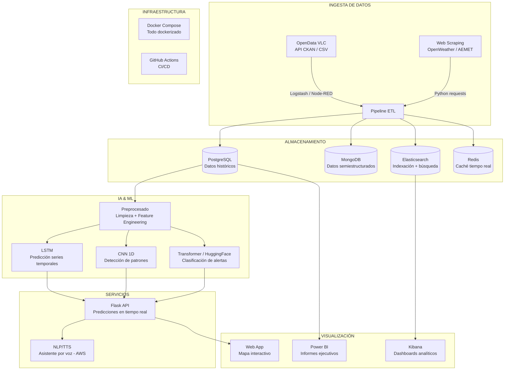

# 🏆 Propuesta de Proyecto Final — Máster IA & Big Data

## Contexto

Proyecto individual para el curso de especialización en IA y Big Data (IES Abastos). Plazo: **27 abril → 25 mayo** (memoria) / **28 mayo** (presentación). Requisito clave: usar contenidos de **todos los módulos** del curso y basarse en datos de [OpenData Valencia](https://opendata.vlci.valencia.es/).

---

## 1. Análisis de Datasets Candidatos

He explorado las 294 datasets del portal. Estos son los **5 finalistas**, evaluados por riqueza de datos, potencial de IA, cobertura de asignaturas y viabilidad para 1 persona en 1 mes:

| # | Dataset | Formato | Volumen | Potencial IA | Cobertura Módulos | Viabilidad 1 mes |
|---|---------|---------|---------|-------------|-------------------|-----------------|
| 🥇 | **Calidad del Aire (horario, 2016+)** | CSV | ~500K+ filas, 22 parámetros, 10 estaciones | ⭐⭐⭐⭐⭐ | ⭐⭐⭐⭐⭐ | ⭐⭐⭐⭐ |
| 🥈 | ValenBisi Disponibilidad | JSON/GeoJSON (tiempo real) | ~280 estaciones, actualización cada 10min | ⭐⭐⭐⭐ | ⭐⭐⭐⭐ | ⭐⭐⭐ |
| 🥉 | Intensidad Tráfico (espiras) | GeoJSON/WFS | ~600 puntos medida, intensidad horaria | ⭐⭐⭐⭐ | ⭐⭐⭐ | ⭐⭐⭐ |
| 4 | Quejas y Sugerencias | CSV | Desde 2020, por distritos/barrios | ⭐⭐⭐ | ⭐⭐⭐⭐ | ⭐⭐⭐⭐ |
| 5 | Sensor Ruido Russafa (diario) | CSV | Datos diarios, 1 sensor | ⭐⭐ | ⭐⭐⭐ | ⭐⭐⭐⭐⭐ |

---

## 2. Dataset Elegido: 🥇 Calidad del Aire

> [!IMPORTANT]
> **Dataset**: [Dades horaris qualitat de l'aire desde 2016](https://opendata.vlci.valencia.es/dataset/hourly-air-quality-data-since-2016)
> 
> **¿Por qué este y no otro?** Es el dataset con mayor riqueza y profundidad del portal. Combina series temporales (ideal para LSTM), múltiples variables numéricas (ideal para CNN 1D y modelos predictivos), datos geoespaciales (10 estaciones con coordenadas), y un tema de impacto social (salud pública y smart cities).

### Datos disponibles

- **Estaciones**: Av. França, Bulevard Sud, Molí del Sol, Pista Silla, Politècnic, Vivers, Centre, Conselleria Meteo, Natzaret Meteo, Port València
- **Parámetros de contaminación**: PM1, PM2.5, PM10, NO, NO₂, NOx, O₃, SO₂, CO, NH₃, C₇H₈ (tolueno), C₆H₆ (benceno), C₈H₁₀ (xileno)
- **Parámetros meteorológicos**: Velocidad/dirección viento, temperatura, humedad, presión, radiación solar, precipitación, vel. máxima viento
- **Ruido**: Nivel sonoro
- **Temporalidad**: Datos horarios desde 2016 → millones de registros
- **Formato**: CSV descargable directamente

### ¿Por qué marca la diferencia frente a otros proyectos?

1. **No es el típico Valenbisi** — La mayoría de compañeros elegirán bicicletas o tráfico porque está sugerido en el PDF
2. **Impacto social real** — La calidad del aire es un tema de salud pública con relevancia post-COVID
3. **Datos multi-dimensionales** — 22 parámetros × 10 estaciones × datos horarios = dataset masivo y rico
4. **Permite cruzar con datos externos** — Se puede enriquecer con meteo (OpenWeather) y tráfico vía web scraping
5. **Las predicciones tienen valor real** — Un sistema que alerte de picos de contaminación tiene aplicación directa

---

## 3. Título del Proyecto

> # **AirVLC — Sistema Inteligente de Monitorización y Predicción de la Calidad del Aire en València**

Subtítulo: *Plataforma de análisis, predicción y alerta basada en IA con datos abiertos de la Red de Vigilancia Atmosférica*

---

## 4. Arquitectura Técnica — Mapping por Asignatura

### Diagrama de Arquitectura



### Desglose por asignatura

| Asignatura | Tecnología | Qué se hace en el proyecto |
|-----------|-----------|---------------------------|
| **Programación IA** | Transformers (HuggingFace), LSTM, CNN | • Modelo LSTM para predicción de PM2.5/NO₂ a 24-48h<br/>• CNN 1D para detectar patrones de contaminación anómalos<br/>• Modelo HuggingFace (text-classification) para clasificar niveles de riesgo y generar alertas en lenguaje natural<br/>• VibeCoding: agente/skill que interprete los datos |
| **Big Data Aplicado** | Docker, ELK Stack, GitHub CI/CD, Web Scraping | • Docker Compose orquestando PostgreSQL + MongoDB + ELK + Redis + Flask<br/>• Logstash pipeline para ingestar CSVs de calidad del aire<br/>• Kibana dashboards con mapas y series temporales<br/>• Web scraping de datos meteorológicos (OpenWeather o AEMET)<br/>• GitHub Actions: test automáticos + despliegue |
| **Modelos de IA** | NLP, NLU, TTS, ASR (AWS) | • Generación automática de boletines de calidad del aire en lenguaje natural (NLG)<br/>• Text-to-Speech (AWS Polly) para leer alertas por voz<br/>• ASR (AWS Transcribe) para consultar el sistema por voz: *"¿Cómo está el aire en Russafa?"*<br/>• NLU para entender la intención del usuario |
| **Sistemas Aprendizaje Automático** | Preprocesado, métricas, FC, CNN | • EDA completo con visualización<br/>• Preprocesado: normalización, tratamiento de nulos, feature engineering (hora, día semana, estación del año)<br/>• Evaluación con métricas: MAE, RMSE, R², matrices de confusión para clasificación<br/>• Comparativa de modelos (FC vs LSTM vs CNN) |
| **Sistemas Big Data** | PostgreSQL, MongoDB, PowerBI, Node-RED, Redis | • PostgreSQL: almacenamiento relacional de series temporales históricas<br/>• MongoDB: almacenamiento de datos semiestructurados (predicciones, alertas, configuración)<br/>• PowerBI: dashboard ejecutivo con KPIs de calidad del aire<br/>• Node-RED: flujo de orquestación para ingesta periódica de datos<br/>• Redis: caché de últimas lecturas para consultas rápidas |

---

## 5. Objetivos del Proyecto

1. **Ingestar y almacenar** datos históricos de calidad del aire de València (2016–actualidad) desde OpenData, enriqueciéndolos con datos meteorológicos externos
2. **Analizar y visualizar** patrones de contaminación por estación, hora, día y estación del año mediante dashboards interactivos (Kibana + PowerBI)
3. **Entrenar modelos predictivos** (LSTM, CNN 1D) capaces de predecir niveles de PM2.5 y NO₂ a 24–48 horas vista
4. **Detectar anomalías** y clasificar niveles de riesgo usando modelos de HuggingFace
5. **Crear un asistente vocal** que informe sobre la calidad del aire actual y predicha mediante NLP + TTS/ASR (AWS)
6. **Desplegar** todo el sistema como microservicios dockerizados con CI/CD

---

## 6. Propuesta de Índice para la Memoria (≤30 páginas)

```
1. Identificación y objetivos del proyecto
   1.1. Motivación y contexto (Smart Cities, salud pública)
   1.2. Objetivos generales y específicos
   1.3. Alcance del proyecto

2. Diseño del proyecto
   2.1. Arquitectura del sistema (diagrama de capas)
   2.2. Tecnologías utilizadas
   2.3. Fuentes de datos
   2.4. Flujo de trabajo / procesamiento de datos

3. Desarrollo del proyecto
   3.1. Ingesta de datos (Logstash + Node-RED + Web Scraping)
   3.2. Almacenamiento (PostgreSQL + MongoDB + Elasticsearch + Redis)
   3.3. Análisis exploratorio de datos (EDA)
   3.4. Preprocesado y Feature Engineering
   3.5. Modelos de IA
       3.5.1. LSTM — Predicción de series temporales
       3.5.2. CNN 1D — Detección de patrones
       3.5.3. Transformers — Clasificación de alertas
   3.6. Servicios NLP/NLU/TTS/ASR (AWS)
   3.7. API Flask y despliegue (Docker + CI/CD)
   3.8. Visualización (Kibana + PowerBI)

4. Evaluación y resultados
   4.1. Métricas de los modelos
   4.2. Comparativa de modelos
   4.3. Resultados de los dashboards

5. Conclusiones y trabajo futuro

6. Referencias

Anexos
   A. Configuración Docker (docker-compose.yml, Dockerfiles)
   B. Configuración ELK (elasticsearch.yml, kibana.yml, logstash.conf)
   C. Flujos Node-RED (flows.json)
   D. Notebooks (EDA, entrenamiento)
```

---

## 7. Calendario de Trabajo (4 semanas)

> [!NOTE]
> Calendario realista para 1 persona. Cada semana tiene un entregable claro.

### Semana 1 — Fundamentos (27 abril → 3 mayo)
| Día | Tarea |
|-----|-------|
| Dom 27 | Configurar repositorio GitHub + Docker Compose base (PostgreSQL + MongoDB + ELK + Redis) |
| Lun 28 | Descargar dataset calidad del aire + EDA inicial en Jupyter |
| Mar 29 | Diseñar esquema PostgreSQL + cargar datos históricos |
| Mié 30 | Configurar Logstash pipeline para ingestar CSV → Elasticsearch |
| Jue 1 | Web scraping de datos meteorológicos (OpenWeather API / AEMET) |
| Vie 2 | Almacenar datos meteorológicos en MongoDB + cruce con datos aire |
| Sáb 3 | Node-RED: flujo de ingesta periódica + Redis caché |

**🎯 Entregable S1**: Infraestructura completa dockerizada + datos cargados en todas las BBDD

### Semana 2 — Inteligencia Artificial (4 mayo → 10 mayo)
| Día | Tarea |
|-----|-------|
| Dom 4 | Preprocesado completo: limpieza, normalización, feature engineering |
| Lun 5 | Entrenamiento modelo LSTM para predicción PM2.5 |
| Mar 6 | Entrenamiento modelo CNN 1D para detección de patrones |
| Mié 7 | Ajuste de hiperparámetros + evaluación métricas (MAE, RMSE, R²) |
| Jue 8 | Modelo HuggingFace: clasificación de niveles de riesgo |
| Vie 9 | Comparativa de modelos (FC vs LSTM vs CNN) + visualización resultados |
| Sáb 10 | API Flask: endpoints de predicción |

**🎯 Entregable S2**: Modelos entrenados + API Flask funcionando

### Semana 3 — Servicios y Visualización (11 mayo → 17 mayo)
| Día | Tarea |
|-----|-------|
| Dom 11 | Kibana: dashboards de calidad del aire (mapas, series temporales, alertas) |
| Lun 12 | PowerBI: informe ejecutivo con KPIs |
| Mar 13 | NLP: generación automática de boletines en lenguaje natural |
| Mié 14 | AWS Polly (TTS): lectura de alertas por voz |
| Jue 15 | AWS Transcribe (ASR): consulta por voz al sistema |
| Vie 16 | Integración NLU: intención del usuario → respuesta del sistema |
| Sáb 17 | GitHub Actions: CI/CD pipeline (tests + build Docker) |

**🎯 Entregable S3**: Sistema completo end-to-end funcionando

### Semana 4 — Documentación y Pulido (18 mayo → 25 mayo)
| Día | Tarea |
|-----|-------|
| Dom 18 | Redacción memoria: capítulos 1-2 (objetivos + diseño) |
| Lun 19 | Redacción memoria: capítulo 3 (desarrollo — ingesta + almacenamiento) |
| Mar 20 | Redacción memoria: capítulo 3 cont. (modelos IA + servicios) |
| Mié 21 | Redacción memoria: capítulo 4 (evaluación + resultados) |
| Jue 22 | Redacción memoria: capítulo 5 + referencias + anexos |
| Vie 23 | Revisión ortográfica + formato (Arial 11pt, márgenes, etc.) |
| Sáb 24 | Preparar presentación (10 min) + ensayo |
| **Dom 25** | **📤 ENTREGA MEMORIA** |

**🎯 Entregable S4**: Memoria completa + presentación + código empaquetado

---

## 8. Elementos que Marcan la Diferencia (nivel concurso)

| Aspecto | Lo que haría un proyecto "normal" | Lo que hace AirVLC |
|---------|----------------------------------|---------------------|
| **Datos** | Un solo CSV cargado a mano | Pipeline automatizado con múltiples fuentes (OpenData + OpenWeather + scraping) |
| **Almacenamiento** | Solo PostgreSQL | Arquitectura políglota: PostgreSQL + MongoDB + Elasticsearch + Redis |
| **IA** | Una regresión lineal | LSTM + CNN 1D + Transformers con comparativa de métricas |
| **Visualización** | Gráficos matplotlib | Kibana dashboards interactivos + PowerBI + mapa web |
| **Interacción** | Nada | Asistente de voz con NLP/TTS/ASR |
| **Infraestructura** | Scripts sueltos | Docker Compose + CI/CD con GitHub Actions |
| **Documentación** | Mínima | Memoria profesional con arquitectura, métricas y anexos completos |

---

## User Review Required

> [!IMPORTANT]
> **Necesito tu confirmación sobre estos puntos antes de avanzar:**

### Preguntas clave

1. **¿Te convence el dataset de Calidad del Aire?** Si prefieres otro (ValenBisi, tráfico...) podemos cambiar la propuesta manteniendo la misma estructura
2. **¿Tienes cuenta de AWS Academy/Free Tier?** Para la parte de TTS/ASR con Polly y Transcribe. Si no, podemos usar alternativas open-source (Whisper para ASR, pyttsx3 para TTS)
3. **¿Tu equipo puede con Docker Compose corriendo PostgreSQL + MongoDB + ELK + Redis simultáneamente?** Necesitas al menos 8GB RAM. Si no, podemos simplificar
4. **¿Cuántas horas/día puedes dedicar realistamente?** El calendario asume ~4-5 horas/día. Si es menos, recortamos alcance
5. **¿Quieres que incluya un MCP (Model Context Protocol) para que un agente IA pueda consultar los datos?** Sería un extra potente pero añade complejidad

---

## Fuentes de Datos

| Fuente | URL | Uso |
|--------|-----|-----|
| Calidad del Aire (principal) | [OpenData VLC](https://opendata.vlci.valencia.es/dataset/hourly-air-quality-data-since-2016) | Dataset principal — series temporales horarias |
| Estaciones contaminación (geolocalización) | [OpenData VLC](https://opendata.vlci.valencia.es/dataset/estacions-contaminacio-atmosferiques-estaciones-contaminacion-atmosfericas) | Ubicación geográfica de las estaciones |
| Datos meteorológicos | [OpenWeather API](https://openweathermap.org/api) o [AEMET OpenData](https://opendata.aemet.es/) | Enriquecimiento con datos meteo (web scraping) |
| Sensor de ruido Russafa | [OpenData VLC](https://opendata.vlci.valencia.es/dataset/t251234-daily) | Dato complementario para correlación ruido-contaminación |
| Emisiones GEI Valencia | [OpenData VLC](https://opendata.vlci.valencia.es/dataset/gei-emissions-data-in-valencia) | Contexto macro de emisiones |
