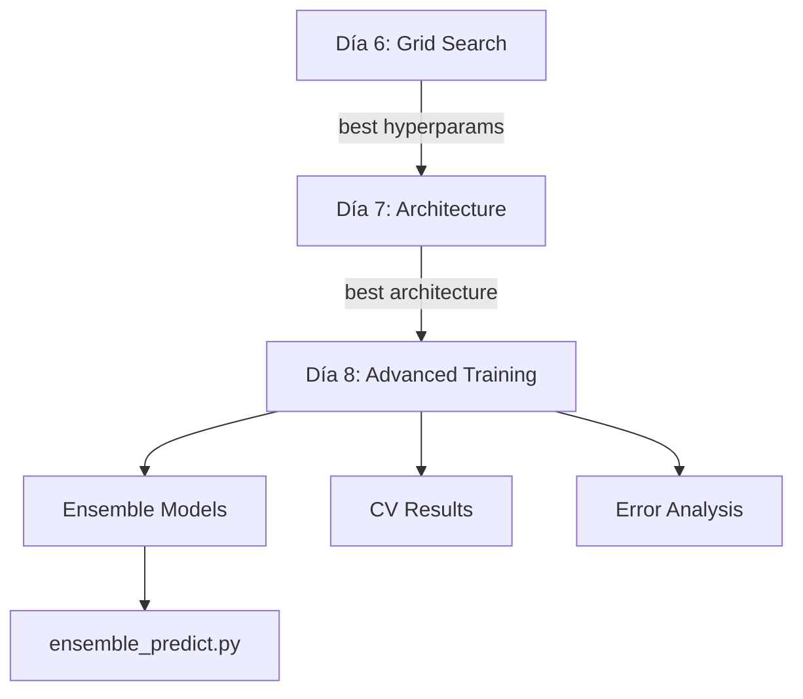

# Walkthrough — Semana 2, Días 6-7-8

## Resumen de Cambios

Se han creado todos los deliverables planificados para los días 6, 7 y 8, incluyendo scripts de entrenamiento para Google Colab y un módulo de predicción ensemble reutilizable.

---

## Archivos Creados/Modificados

### [MODIFY] [hyperparams_grid.json](file:///Users/miguel/Desktop/Curso%20IA/Propuesta%20Proyecto/AirVLCProyecto/hyperparams_grid.json)
- **Antes**: 3 configuraciones básicas
- **Ahora**: 16 configuraciones cubriendo:
  - Learning rates: `1e-3`, `5e-4`, `1e-4`
  - Batch sizes: `32`, `64`, `128`, `256`
  - Optimizers: `adam`, `rmsprop`
  - Dropout: `0.2`, `0.3`, `0.4`
  - Sequence lengths: `24`, `48` horas

---

### [NEW] [06_Colab_HyperParam_Search.py](file:///Users/miguel/Desktop/Curso%20IA/Propuesta%20Proyecto/AirVLCProyecto/notebooks/06_Colab_HyperParam_Search.py)
**Día 6 — Exploración de Hiperparámetros**

Funcionalidad clave:
- **`train_lstm()`**: Función reutilizable que acepta todos los hiperparámetros del grid, entrena el modelo, y devuelve métricas + modelo + scaler
- **Grid search automático**: Itera sobre las 16 configuraciones del JSON
- **Registro progresivo**: Guarda resultados parciales en CSV tras cada configuración (protección contra interrupciones)
- **Visualizaciones**: Heatmaps de MAE (dropout vs lr, batch vs lr, seq_length vs lr) + bar chart Top 5
- **Selección automática**: Guarda el checkpoint del mejor modelo

Outputs:
- `results/day6_hyperparams_results.csv`
- `results/best_model_day6.keras`
- `results/day6_heatmaps.png`
- `results/day6_top5.png`

---

### [NEW] [07_Colab_Architecture_Experiments.py](file:///Users/miguel/Desktop/Curso%20IA/Propuesta%20Proyecto/AirVLCProyecto/notebooks/07_Colab_Architecture_Experiments.py)
**Día 7 — Arquitectura & Feature Engineering**

Funcionalidad clave:
- **Carga automática** de los mejores hiperparámetros del Día 6 (lee `day6_hyperparams_results.csv`)
- **Feature Engineering**: Encodings cíclicos sin/cos si no existen en el dataset
- **4 arquitecturas** comparadas:
  - `LSTM_2Layer`: 2 capas LSTM (128→64) — simplificado
  - `LSTM_3Layer`: 3 capas LSTM (128→64→32) — baseline original
  - `BiLSTM`: Bidirectional LSTM — captura patrones en ambas direcciones
  - `LSTM_Attention`: LSTM + capa de atención Bahdanau — pondera la importancia temporal
- **Visualizaciones**: Barras comparativas (MAE/RMSE/R²) + curvas de entrenamiento por arquitectura

Outputs:
- `results/day7_architecture_results.csv`
- `results/best_model_day7.keras`
- `results/day7_architecture_comparison.png`
- `results/day7_training_curves.png`

---

### [NEW] [08_Colab_Advanced_Training_Eval.py](file:///Users/miguel/Desktop/Curso%20IA/Propuesta%20Proyecto/AirVLCProyecto/notebooks/08_Colab_Advanced_Training_Eval.py)
**Día 8 — Entrenamiento Avanzado & Evaluación**

Funcionalidad clave:
- **Regularización L2** (`1e-4`) en kernels LSTM
- **GaussianNoise** (`0.01`) en inputs para robustez
- **Early Stopping mejorado**: Monitorea `val_mae` (no `val_loss`), patience=5
- **ReduceLROnPlateau mejorado**: Cooldown=2 para evitar reducciones prematuras
- **Ensemble**: 3 modelos entrenados con seeds distintas (42, 123, 456), predicciones promediadas
- **Cross-Validation Temporal**: TimeSeriesSplit 5-fold, respetando orden cronológico
- **Análisis de errores completo**: Real vs Predicción, distribución residuos, residuos vs predicción (homocedasticidad), Q-Q Plot

Outputs:
- `results/day8_advanced_results.csv`
- `results/day8_cv_results.csv`
- `results/ensemble_models/model_seed42.keras`
- `results/ensemble_models/model_seed123.keras`
- `results/ensemble_models/model_seed456.keras`
- `results/day8_error_analysis.png`

---

### [NEW] [ensemble_predict.py](file:///Users/miguel/Desktop/Curso%20IA/Propuesta%20Proyecto/AirVLCProyecto/src/ml/ensemble_predict.py)
**Módulo de Predicción Ensemble**

Clase `EnsemblePredictor` con métodos:
- `predict_scaled()`: Predicciones normalizadas
- `predict()`: Predicciones en escala real (µg/m³)
- `predict_with_uncertainty()`: Media + desviación estándar entre modelos
- Carga automática de todos los `.keras` del directorio ensemble

---

## Instrucciones de Uso en Google Colab

### Día 6
1. Sube `06_Colab_HyperParam_Search.py` y `hyperparams_grid.json` a tu Google Drive
2. En Colab, monta Drive y ajusta `DATA_PATH` y `GRID_PATH`
3. Descomenta las líneas de montaje de Drive
4. Ejecuta el script completo — tardará varias horas según GPU

### Día 7
1. **Requiere**: Que el Día 6 haya generado `day6_hyperparams_results.csv`
2. Sube `07_Colab_Architecture_Experiments.py` a Drive
3. Ajusta rutas y ejecuta — el script carga automáticamente los mejores hiperparámetros

### Día 8
1. **Requiere**: Resultados del Día 6 y Día 7
2. Sube `08_Colab_Advanced_Training_Eval.py` a Drive
3. Ejecuta — incluye modelo avanzado, ensemble y cross-validation

> [!IMPORTANT]
> Los scripts guardan resultados parciales progresivamente. Si una ejecución se interrumpe, el CSV parcial se conserva y puedes retomar desde donde quedó.

## Flujo de Dependencias

