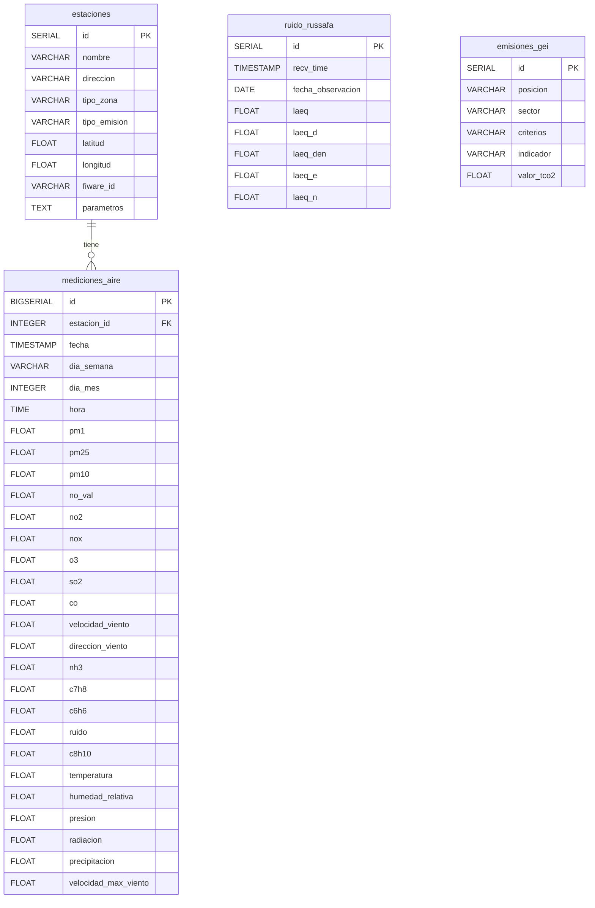

# Semana 1 — Martes 29 y Miércoles 30: Carga de datos en PostgreSQL y Elasticsearch

## Contexto

Tenemos la infraestructura Docker corriendo (PostgreSQL, Redis, MongoDB Atlas, Elasticsearch, Kibana) y las conexiones verificadas con `test_connections.py`. Los datasets están descargados en `data/raw/`:

| Archivo | Filas | Descripción |
|---------|-------|-------------|
| `calidad-aire-2016.csv` | ~449K | Datos horarios de calidad del aire (12 estaciones, 22 parámetros) — separador `;` |
| `cda-export.csv` | ~1.8K | Sensor de ruido Russafa (datos diarios) — separador `;` |
| `datos-emisiones-gei-en-valencia-cas.csv` | ~126 | Emisiones GEI por sector — separador `;` |
| `estaciones-geojson.geojson` | 11 features | Ubicación geoespacial de estaciones (GeoJSON) |

---

## 🔵 MARTES 29 — Diseño Esquema PostgreSQL + Carga de Datos Históricos

### Diseño del esquema relacional

Esquema normalizado con 4 tablas principales en PostgreSQL:



> [!IMPORTANT]
> **Decisiones de diseño clave:**
> - La tabla `mediciones_aire` usa FK a `estaciones` para normalizar (evitar repetir nombre de estación en 449K filas)
> - Se mapean los nombres de estación del CSV con los del GeoJSON para vincular coordenadas
> - Los campos numéricos son `FLOAT` (nullable) porque hay muchas celdas vacías en el CSV original
> - Se crea un índice compuesto en `(estacion_id, fecha)` para optimizar consultas de series temporales
> - `ruido_russafa` es tabla separada porque tiene su propia temporalidad (diaria vs horaria)

### Script ETL Python: `src/scripts/load_postgres.py`

#### [NEW] [load_postgres.py](file:///Users/miguel/Desktop/Curso%20IA/Propuesta%20Proyecto/AirVLCProyecto/src/scripts/load_postgres.py)

Script que:
1. Crea las 4 tablas con el esquema anterior (con `IF NOT EXISTS`)
2. Carga `estaciones-geojson.geojson` → tabla `estaciones`
3. Carga `calidad-aire-2016.csv` → tabla `mediciones_aire` (con mapeo de estación → FK, usando `COPY` o batch insert para rendimiento)
4. Carga `cda-export.csv` → tabla `ruido_russafa`
5. Carga `datos-emisiones-gei-en-valencia-cas.csv` → tabla `emisiones_gei`
6. Muestra resumen de filas insertadas por tabla

**Estrategia de rendimiento para las 449K filas:**
- Usar `psycopg2.extras.execute_values()` con batches de 5000 filas
- Crear índices DESPUÉS de la carga masiva
- Mapeo de estaciones en memoria (dict) para resolver FK sin JOINs

---

## 🟢 MIÉRCOLES 30 — Pipeline Logstash para Ingesta CSV → Elasticsearch

### Configuración Logstash

#### [NEW] [logstash.conf](file:///Users/miguel/Desktop/Curso%20IA/Propuesta%20Proyecto/AirVLCProyecto/docker/logstash/pipeline/logstash.conf)

Pipeline que:
1. **Input**: Lee `calidad-aire-2016.csv` con el plugin `file` (o `stdin`)
2. **Filter**: Parsea CSV con separador `;`, convierte tipos, gestiona campos vacíos, parsea fechas
3. **Output**: Indexa en Elasticsearch como `airvlc-calidad-aire`

#### [NEW] [logstash.yml](file:///Users/miguel/Desktop/Curso%20IA/Propuesta%20Proyecto/AirVLCProyecto/docker/logstash/config/logstash.yml)

Configuración base de Logstash.

#### [MODIFY] [docker-compose.yml](file:///Users/miguel/Desktop/Curso%20IA/Propuesta%20Proyecto/AirVLCProyecto/docker-compose.yml)

Añadir servicio `logstash` al docker-compose:
- Imagen: `docker.elastic.co/logstash/logstash:8.10.4` (misma versión que ES/Kibana)
- Volúmenes: pipeline config + datos CSV
- Dependencia de Elasticsearch

### Script de verificación Elasticsearch

#### [NEW] [verify_elasticsearch.py](file:///Users/miguel/Desktop/Curso%20IA/Propuesta%20Proyecto/AirVLCProyecto/src/scripts/verify_elasticsearch.py)

Script que consulta Elasticsearch para verificar:
- Que el índice `airvlc-calidad-aire` existe
- Número total de documentos indexados
- Muestra de documentos
- Distribución por estación

---

## Archivos a crear/modificar

| Acción | Archivo | Descripción |
|--------|---------|-------------|
| **[NEW]** | `src/scripts/load_postgres.py` | ETL: esquema + carga masiva a PostgreSQL |
| **[NEW]** | `docker/logstash/pipeline/logstash.conf` | Pipeline Logstash CSV → Elasticsearch |
| **[NEW]** | `docker/logstash/config/logstash.yml` | Config base Logstash |
| **[MODIFY]** | `docker-compose.yml` | Añadir servicio Logstash |
| **[NEW]** | `src/scripts/verify_elasticsearch.py` | Verificación datos en Elasticsearch |

---

## Verificación

### Tras Martes (PostgreSQL)
```bash
# Ejecutar el script de carga
python src/scripts/load_postgres.py

# Verificar con psql (o desde Python)
# SELECT COUNT(*) FROM estaciones;          → 11-12
# SELECT COUNT(*) FROM mediciones_aire;     → ~449K
# SELECT COUNT(*) FROM ruido_russafa;       → ~1.8K
# SELECT COUNT(*) FROM emisiones_gei;       → ~125
```

### Tras Miércoles (Elasticsearch)
```bash
# Levantar Logstash
docker compose up -d logstash

# Esperar a que procese y verificar
python src/scripts/verify_elasticsearch.py

# También verificable desde Kibana en http://localhost:5601
```

---

## Open Questions

> [!NOTE]
> **Mapeo estaciones CSV ↔ GeoJSON**: Los nombres en el CSV (`Avda. Francia`, `Bulevard Sud`, etc.) no coinciden 
> exactamente con los del GeoJSON (`Francia`, `Boulevar Sur`, etc.). Se necesita un mapeo manual. Lo he preparado 
> basándome en los datos observados — ¿te parece correcto el mapeo? Lo incluiré en el script.

> [!NOTE]
> **Estaciones sin coordenadas**: El CSV tiene 12 estaciones pero el GeoJSON tiene 11 (con nombres diferentes como `Patraix`, `Dr. Lluch`, `Cabanyal`, `Olivereta` que no aparecen en el CSV). Algunas estaciones del CSV como `Puerto Moll Trans. Ponent`, `Puerto llit antic Túria`, `Nazaret Meteo`, `Consellería Meteo` no tienen equivalente directo en el GeoJSON. Insertaré estas estaciones sin coordenadas y podremos completarlas después si es necesario.
