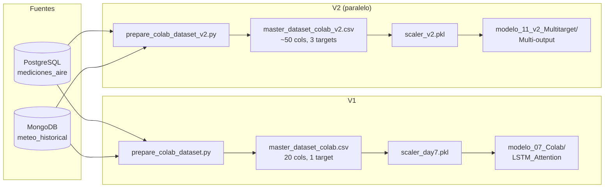

## Estrategia confirmada
- **Versionado paralelo (sufijo `_v2`)**: nuevo dataset, scaler, scripts, notebooks y modelos coexisten con v1. La API/Flutter no se tocan en esta tanda.
- **Alcance de esta tanda**: Sprint 1 (cierre) + Sprint 2 (preparar el notebook que tú correrás en Colab y bajarás los `.keras`).
- **Tras Sprint 2** abrimos otra tanda para Sprint 3 (Flask v2 multitarget) y Sprint 4 (Flutter rediseñado). No se tocan ni `src/api/`, ni `src/services/chatbot_orchestrator.py`, ni `app/lib/` en este pase.

## Estado actual relevante
- `src/ml/prepare_colab_dataset.py` ya está reescrito al estilo v2 (lags, rolling means, `is_weekend`, `is_fallas`, sin/cos de hora y mes, NO2/O3) pero **sobrescribe** el CSV v1 al ser el mismo nombre de salida (`data/processed/master_dataset_colab.csv`). Tenemos que separarlos.
- v1 sigue dependiendo de `master_dataset_colab.csv` (20 cols) y `models/scaler_day7.pkl` desde [src/api/feature_extractor.py](src/api/feature_extractor.py) líneas 14-20 y desde [src/services/chatbot_orchestrator.py](src/services/chatbot_orchestrator.py) línea 97. No los rompemos.

## Decisiones clave
1. **El script in-place se trata como v2**: lo movemos a `src/ml/prepare_colab_dataset_v2.py` (mismo contenido) y lo redirigimos a escribir `data/processed/master_dataset_colab_v2.csv`. Recuperamos `src/ml/prepare_colab_dataset.py` (v1) desde git para que el pipeline de v1 vuelva a ser ejecutable.
2. **Regeneramos `master_dataset_colab.csv` (v1)** corriendo el script v1 restaurado, para que la API v1 siga funcionando exactamente como antes.
3. **Generamos `master_dataset_colab_v2.csv`** corriendo el script v2 nuevo. Mismo contenido que el CSV ya regenerado el 5 de mayo, pero con el nombre correcto.
4. **Validación del dataset v2** se hace con un script `src/ml/validate_dataset_v2.py` que reporta filas por estación, NaNs, rangos y se documenta en `docs/v2AirVLCdocs/walkthrough_sprint1.md`.
5. **El notebook v2 de Colab** (`notebooks/11_v2_Colab_Multitarget.ipynb`) entrena 3 arquitecturas comparables y exporta el ganador a `models/modelo_11_v2_Multitarget/`. El entrenamiento real lo haces tú en Colab; aquí solo dejo el notebook listo y validado localmente.

## Archivos a crear / modificar / restaurar

### Sprint 1 — Cierre del dataset v2
- **[NEW]** `src/ml/prepare_colab_dataset_v2.py`: copia del actual `prepare_colab_dataset.py`, cambiando solo:
  - Cabecera de docstring (`v2 multitarget`).
  - Línea de salida → `data/processed/master_dataset_colab_v2.csv`.
- **[RESTORE]** `src/ml/prepare_colab_dataset.py` (v1) usando `git show HEAD:src/ml/prepare_colab_dataset.py` para devolverlo al estado de v1 (sin lags/rollings, solo `pm25`).
- **[NEW]** `src/ml/validate_dataset_v2.py`: script ligero que carga el CSV v2 y reporta:
  - Total de filas, rango de fechas, conteo por estación.
  - Recuento de NaNs por columna.
  - Estadísticos básicos de los 3 targets y de los nuevos features.
- **[REGENERATE]** `data/processed/master_dataset_colab.csv` (v1) corriendo el script v1.
- **[REGENERATE]** `data/processed/master_dataset_colab_v2.csv` corriendo el script v2.
- **[NEW]** `docs/v2AirVLCdocs/sprint1/walkthrough.md`: tabla de columnas v1 vs v2, decisiones (por qué `is_fallas`, por qué lags 1/3/6/24h, por qué rolling 6/12/24h), evidencia de validación.
- **[UPDATE]** `docs/v2AirVLCdocs/task.md`: añadir sección "Sprint 1 — Cierre" y marcar los nuevos sub-tasks (rename CSV, restaurar v1, validación).

### Sprint 2 — Modelado multitarget en Colab
- **[NEW]** `src/ml/prepare_dataset_v2.py`: utilidades para cargar el CSV v2, construir secuencias `(N, 24, n_features)` y matriz `y` de 3 columnas (`pm25`, `no2`, `o3`). Reutilizable desde el notebook y desde la futura API v2.
- **[NEW]** `src/ml/generate_scaler_v2.py`: genera `models/scaler_v2.pkl` (MinMaxScaler con todas las columnas de v2, incluyendo lags/rollings/onehot). Mismo patrón que [src/ml/generate_scaler.py](src/ml/generate_scaler.py).
- **[NEW]** `notebooks/11_v2_Colab_Multitarget.ipynb` con secciones:
  1. Setup Colab (montaje Drive, instalación, imports).
  2. Carga de `master_dataset_colab_v2.csv` y `scaler_v2.pkl`.
  3. Split temporal cronológico por estación (80/10/10).
  4. Construcción de secuencias multitarget.
  5. Tres arquitecturas comparadas:
     - `LSTM_Attention_Multi` (Bahdanau + `Dense(3)`).
     - `CNN_LSTM_Attention_Multi` (Conv1D → LSTM → Attention → `Dense(3)`).
     - `Transformer_Encoder_Multi` (`MultiHeadAttention` + LayerNorm + GAP + `Dense(3)`, nativo Keras).
  6. Loss: `mse` baseline + experimento opcional con loss asimétrica (penaliza infrapredicción de picos).
  7. Métricas separadas por target: MAE, RMSE, R² de `pm25`, `no2`, `o3`.
  8. Selección de ganador y export:
     - `models/modelo_11_v2_Multitarget/best_model_v2.keras`
     - `models/modelo_11_v2_Multitarget/day11_v2_results.csv`
     - `models/modelo_11_v2_Multitarget/training_history.json`
- **[NEW]** `src/scripts/generate_v2_notebook.py` (opcional, reutiliza patrón de `src/scripts/generate_colab_notebook.py`): script que regenera el .ipynb desde plantilla. Útil para reproducibilidad.
- **[NEW]** `docs/v2AirVLCdocs/sprint2/implementation_plan.md` y `docs/v2AirVLCdocs/sprint2/task.md`: detalle de Sprint 2 (entregables del notebook, criterios de aceptación, métricas objetivo).
- **[NEW]** `docs/v2AirVLCdocs/sprint2/walkthrough.md`: stub que rellenamos cuando vuelvas con resultados reales de Colab.

## Diagrama: flujo de datos v1 vs v2

## Verificación al final del pase
1. `python src/ml/prepare_colab_dataset.py` regenera v1 sin error y la API v1 ([src/api/app.py](src/api/app.py)) sigue arrancando.
2. `python src/ml/prepare_colab_dataset_v2.py` produce `master_dataset_colab_v2.csv` con 3 targets y todas las features nuevas.
3. `python src/ml/validate_dataset_v2.py` reporta 0 NaNs y conteo correcto por estación.
4. `python src/ml/generate_scaler_v2.py` produce `models/scaler_v2.pkl` con `feature_names_in_` exhaustivo.
5. El notebook abre en Colab, ejecuta hasta la celda de comparación de arquitecturas (sin entrenar de verdad aquí; eso lo haces tú).

## Lo que NO hago en este pase (próxima tanda)
- Tocar `src/api/feature_extractor.py`, `src/api/routes.py`, `src/api/schemas.py`, `src/services/chatbot_orchestrator.py`, `src/api/es_indexer.py` (Sprint 3).
- Rediseñar `app/lib/` (Sprint 4).
- Reescribir `src/ml/risk_classifier.py` para multipolutante (Sprint 3, lo haremos como `risk_classifier_v2.py`).