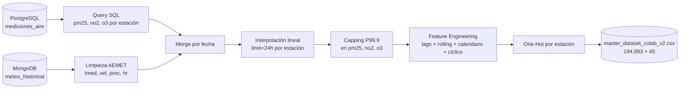

# Sprint 1 v2 — Cierre del Dataset Multivariante

> Sprint cerrado el 5 de mayo de 2026. v1 sigue funcionando en paralelo;
> v2 arranca aquí su pipeline propio.
>
> **Hot-fix 5 may 2026 (tarde)**: tras detectar en Sprint 2 que el
> sequencing producía 0 ventanas en Colab, se descubrió un bug en la
> SQL: `mediciones_aire.fecha` es siempre `00:00:00` y la hora vive en
> una columna `hora` separada. La SQL ahora hace
> `SELECT (m.fecha::date + m.hora) AS fecha`, garantizando timestamps
> horarios reales. Dataset regenerado con 194,198 × 45 (antes 194,993)
> y rango horario `2016-01-02 00:00:00 → 2021-12-31 23:00:00`.

## 1. Objetivo del Sprint

Construir el nuevo dataset maestro `data/processed/master_dataset_colab_v2.csv`
con los tres contaminantes oficiales del Índice de Calidad del Aire (PM2.5, NO₂,
O₃) y un Feature Engineering "extremo" que el modelo v1 no tenía. v1 (un único
target PM2.5) queda intacto: la API actual y los notebooks históricos siguen
ejecutándose sin cambios.

## 2. Diferencias clave v1 → v2

| Aspecto | v1 | v2 |
|---|---|---|
| Targets | `pm25` | `pm25`, `no2`, `o3` |
| Lags | `pm25_lag1/2/3` | `{pm25,no2,o3}_lag{1,3,6,24}` |
| Rolling means | `pm25_rolling_6h` | `{pm25,no2,o3}_rolling_{6,12,24}h` |
| Calendario | `hora_del_dia`, `dia_de_la_semana` | + `mes`, `is_weekend`, `is_fallas` |
| Codificación cíclica | — | `hora_sin/cos`, `mes_sin/cos` |
| Capping de outliers | en pm25 | en los 3 targets (P99.9) |
| Salida | `master_dataset_colab.csv` (21 cols) | `master_dataset_colab_v2.csv` (45 cols) |
| Script | `src/ml/prepare_colab_dataset.py` | `src/ml/prepare_colab_dataset_v2.py` |

## 3. Decisiones de diseño

### 3.1 ¿Por qué multivariante?

El Índice oficial de Calidad del Aire (ICA, según directiva europea y la red
valenciana de calidad del aire) se calcula tomando el **peor** valor entre los
contaminantes monitorizados — entre los que están NO₂, O₃ y PM2.5. Predecir solo
PM2.5 (como hacía v1) puede dar una falsa sensación de seguridad cuando el O₃
se dispara en verano por radiación solar y temperatura. Con tres salidas, la
API v2 (Sprint 3) podrá decir: *"el aire es MALO porque NO₂ está en 45 µg/m³,
aunque el PM2.5 está normal"*.

### 3.2 ¿Por qué lags 1, 3, 6, 24?

- `lag1` captura inercia inmediata (la mejor señal autorregresiva, hora a hora).
- `lag3` y `lag6` capturan ventanas cortas/medias del mismo día (picos de tráfico).
- `lag24` captura el ciclo diario completo: la contaminación de "ayer a esta
  hora" suele ser muy parecida.

### 3.3 ¿Por qué rolling 6, 12, 24h?

- `rolling_6h` ≈ tendencia de las últimas horas (suaviza ruido).
- `rolling_12h` ≈ medio día (mañana o noche).
- `rolling_24h` ≈ ciclo diurno-nocturno completo.

### 3.4 ¿Por qué `is_fallas` (15–19 marzo)?

Las Fallas de Valencia son eventos masivos con quemas (NO₂, PM2.5) y mascletàs
(picos puntuales de PM y SO₂). Son un sesgo sistemático que el modelo no
detectaría con `mes_sin/cos` solos. Con un booleano dedicado el modelo aprende
a tratar esa semana como régimen distinto.

### 3.5 ¿Por qué `is_weekend`?

Los fines de semana caen las concentraciones de NO₂ (menor tráfico de hora
punta) pero NO necesariamente las de O₃ (la química del ozono es no-lineal: con
menos NO₂ "consumiendo" O₃, este puede subir). Sin esta variable, el modelo
aprende un patrón sesgado al perfil de día laborable.

### 3.6 ¿Por qué codificación trigonométrica?

`hora_del_dia=23` y `hora_del_dia=0` son adyacentes en realidad (1h de
distancia) pero numéricamente lejanos. `hora_sin/cos` y `mes_sin/cos` evitan
ese salto y permiten al modelo aprender la circularidad sin trucos.

### 3.7 Capping de outliers (P99.9)

Las series tienen picos extremos (errores de sensor, eventos puntuales) que
empujan el `MinMaxScaler` y aplastan el rango útil de los datos normales.
Cortar al P99.9 mantiene el "techo" estadísticamente realista sin perder
información del 99.9 % de los registros.

## 4. Pipeline ejecutado



## 5. Reporte de validación

> Ejecutado con: `python src/ml/validate_dataset_v2.py --markdown`
> (cifras tras el hot-fix de timestamps).

- **Ruta**: `data/processed/master_dataset_colab_v2.csv`
- **Shape**: 194,198 filas × 45 columnas
- **Rango temporal global**: 2016-01-02 00:00:00 → 2021-12-31 23:00:00

### 5.1 Conteo por estación

| Estación | Filas | Desde | Hasta |
|---|---:|---|---|
| Francia | 36,663 | 2017-01-10 00:00:00 | 2021-12-31 23:00:00 |
| Molí del Sol | 41,809 | 2016-01-02 00:00:00 | 2021-12-31 23:00:00 |
| Pista de Silla | 49,833 | 2016-01-02 00:00:00 | 2021-12-31 23:00:00 |
| Puerto Moll Trans. Ponent | 8,541 | 2021-01-02 00:00:00 | 2021-12-31 23:00:00 |
| Puerto Valencia | 2,689 | 2020-01-11 00:00:00 | 2020-12-31 23:00:00 |
| Puerto llit antic Túria | 4,245 | 2021-01-09 00:00:00 | 2021-12-31 23:00:00 |
| Universidad Politécnica | 50,418 | 2016-01-02 00:00:00 | 2021-12-31 23:00:00 |

### 5.2 Valores NaN

✅ **Sin NaNs en ninguna columna** tras la interpolación + dropna.

### 5.3 Estadísticos de los 3 targets (µg/m³)

| Target | Min | P25 | Mediana | P75 | Max | Media | Std |
|---|---:|---:|---:|---:|---:|---:|---:|
| `pm25` | 0.00 | 5.00 | 9.00 | 15.00 | 74.00 | 11.54 | 9.63 |
| `no2` | 1.00 | 7.00 | 16.00 | 32.00 | 116.00 | 22.43 | 19.86 |
| `o3` | 1.00 | 30.00 | 53.00 | 72.00 | 128.00 | 51.17 | 27.47 |

### 5.4 Huecos temporales (gaps > 1h por estación)

> Tras el hot-fix los gaps son **gaps reales**: antes los timestamps
> idénticos por hora "ocultaban" gaps reales y el script reportaba
> miles de falsos positivos.

| Estación | Gaps>1h | Gap máx (h) |
|---|---:|---:|
| Francia | 31 | 1297.0 |
| Molí del Sol | 19 | 8761.0 |
| Pista de Silla | 41 | 416.0 |
| Puerto Moll Trans. Ponent | 5 | 85.0 |
| Puerto Valencia | 13 | 649.0 |
| Puerto llit antic Túria | 12 | 601.0 |
| Universidad Politécnica | 32 | 313.0 |

> [!NOTE]
> Los gaps son inherentes al portal de datos abiertos de la red valenciana
> (algunas estaciones se desconectan temporadas enteras). Son **gaps reales**,
> no NaNs en el CSV: el sequencing del Sprint 2 los evitará automáticamente
> al construir las ventanas de 24 h por estación, descartando ventanas que
> crucen un hueco mayor de 1 hora.

### 5.5 Lista completa de columnas (45)

```
pm25, no2, o3,
temperatura, velocidad_viento, precipitacion, humedad_relativa,
hora_del_dia, dia_de_la_semana, mes, is_weekend, is_fallas,
pm25_lag1, pm25_lag3, pm25_lag6, pm25_lag24,
no2_lag1, no2_lag3, no2_lag6, no2_lag24,
o3_lag1, o3_lag3, o3_lag6, o3_lag24,
pm25_rolling_6h, pm25_rolling_12h, pm25_rolling_24h,
no2_rolling_6h, no2_rolling_12h, no2_rolling_24h,
o3_rolling_6h, o3_rolling_12h, o3_rolling_24h,
hora_sin, hora_cos, mes_sin, mes_cos,
station_name,
station_Francia, station_Molí del Sol, station_Pista de Silla,
station_Puerto Moll Trans. Ponent, station_Puerto Valencia,
station_Puerto llit antic Túria, station_Universidad Politécnica
```

## 6. Cómo reproducirlo en limpio

```bash
docker compose up -d postgres   # MongoDB es Atlas (remoto)
venv/bin/python src/ml/prepare_colab_dataset_v2.py
venv/bin/python src/ml/validate_dataset_v2.py
```

## 7. Comprobación de no regresión sobre v1

Tras los cambios de v2, se regeneró `master_dataset_colab.csv` (v1) ejecutando
el script v1 restaurado:

```bash
venv/bin/python src/ml/prepare_colab_dataset.py
# → Shape (195_209, 21), 7 estaciones, target pm25 únicamente
```

Esto deja la API v1 (`src/api/feature_extractor.py` y `models/scaler_day7.pkl`)
plenamente operativa. El Sprint 3 v2 introducirá un `feature_extractor_v2.py`
y una nueva ruta `/api/v2/*` sin tocar la v1.

## 8. Próximo paso

Ir al [Sprint 2](../sprint2/implementation_plan.md): notebook Colab multitarget
y nuevo `scaler_v2.pkl`.
