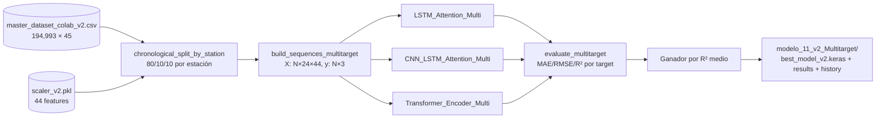

# Sprint 2 v2 — Walkthrough

> ✅ **Sprint cerrado el 6 de mayo de 2026**. Modelo entrenado en Colab
> (T4) con resultados que **superan a v1 monotarget** en todos los
> indicadores comparables, prediciendo además 2 contaminantes nuevos
> (NO₂ y O₃) con R² ≥ 0.82.

## 0. Hot-fix del 5 may 2026 (tarde) — ⚠️ leer antes de re-subir

Al ejecutar el notebook por primera vez en Colab apareció:

```
ValueError: math domain error  →  log10(0) en la barra de progreso
```

Causa: `build_sequences_multitarget` devolvía `(0, 24, 44)`. Tras
debuggear se detectaron **dos bugs encadenados**:

1. **`prepare_colab_dataset_v2.py`**: la SQL hacía
   `SELECT m.fecha, ...` cuando en BD `mediciones_aire.fecha` es
   siempre `00:00:00` y la hora real vive en `mediciones_aire.hora`
   (TIME). Resultado: 194k filas con sólo **2,164** timestamps únicos
   (todas las filas de un día compartían el mismo timestamp).
2. **`prepare_dataset_v2.py`**: el sequencing usaba
   `np.diff(...).astype('timedelta64[m]')`. En local (datetime64[us])
   "tragaba" timestamps idénticos como diff=0 y aceptaba ventanas; en
   Colab (datetime64[ns] + numpy 2.x) la conversión silenciaba todas
   las ventanas → 0 secuencias.

### Ambos bugs corregidos

- SQL: `SELECT (m.fecha::date + m.hora) AS fecha, ...` produce un
  timestamp horario real.
- Sequencing: convierte el index a `int64` ns y compara directamente
  contra `gap_threshold_ns`. Robusto a `us`/`ms`/`ns`.
- Notebook: añadido `assert X_train.shape[0] > 0` con mensaje
  explícito por si alguna vez vuelve a pasar.

### Tras el fix (números reales)

| Métrica | Antes (bug) | Después (fix) |
|---|---:|---:|
| Filas | 194,993 | 194,198 |
| Timestamps únicos | **2,164** | **51,936** |
| Rango horario | 00:00:00 → 00:00:00 | 00:00:00 → 23:00:00 |
| Gaps reales > 1h Pista de Silla | 2,092 (falsos) | 41 (reales) |
| `X_train` (sequencing local) | 28,321 (basura) | **24,657 (válidas)** |

### Qué tienes que hacer ahora en Colab

1. **Borrar de tu Drive** los ficheros viejos:
   ```
   MyDrive/AirVLC_v2/master_dataset_colab_v2.csv   ← borrar
   MyDrive/AirVLC_v2/scaler_v2.pkl                 ← borrar
   ```
2. **Subir las versiones nuevas** desde local:
   ```
   data/processed/master_dataset_colab_v2.csv  (66 MB nuevo)
   models/scaler_v2.pkl                        (~3 KB nuevo)
   ```
3. **Recargar** el notebook nuevo
   `notebooks/11_v2_Colab_Multitarget.ipynb` (regenerado con el
   sequencing robusto y el assert defensivo).
4. Ejecutar de arriba a abajo en GPU T4.

## 1. Estado actual (preparación local)

- ✅ `src/ml/prepare_dataset_v2.py` con utilidades multitarget.
- ✅ `models/scaler_v2.pkl` generado sobre el split de train (sin
  data leakage).
- ✅ `notebooks/11_v2_Colab_Multitarget.ipynb` (27 celdas) regenerable
  con `python src/scripts/generate_v2_notebook.py`.
- ✅ Las 3 arquitecturas Keras nativas validadas localmente
  (forward pass con tensores random):
    - `LSTM_Attention_Multi` — 148,548 params.
    - `CNN_LSTM_Attention_Multi` — 98,372 params.
    - `Transformer_Encoder_Multi` — 107,331 params.

## 2. Resumen ejecutivo del pipeline



## 3. Decisiones que el notebook materializa

- **Ventana 24 h**: 1 día completo de contexto antes de predecir la
  hora siguiente.
- **Bahdanau Attention compartida** entre arquitectura 1 y 2 (la
  reutilizamos vía función helper `BahdanauAttention`).
- **Transformer sin embedding posicional explícito**: 2 bloques
  encoder con `MultiHeadAttention(heads=4, key_dim=32)` + LayerNorm.
- **Loss baseline `mse`**, opcional `asymmetric_mse(alpha=2.0)` para
  re-entrenar el ganador penalizando infrapredicciones.
- **Ranking por R² medio** entre PM2.5, NO₂ y O₃. Si hay empate o
  muy parecidos, se desempata por suma de R²s individuales.

## 4. Resultados reales (Colab, T4, EPOCHS=60, BATCH=128)

### 4.1 Resumen por arquitectura

| Arquitectura | PM2.5 R² | NO₂ R² | O₃ R² | R² medio | Tiempo (s) | Best epoch | Params |
|---|---:|---:|---:|---:|---:|---:|---:|
| 🥇 **LSTM_Attention_Multi** | **0.8571** | **0.8397** | **0.8861** | **0.8610** | 394.7 | 20 | 148,548 |
| 🥈 CNN_LSTM_Attention_Multi | 0.8486 | 0.8341 | 0.8818 | 0.8548 | 710.8 | 44 |  98,372 |
| 🥉 Transformer_Encoder_Multi | 0.8412 | 0.8231 | 0.8740 | 0.8461 | 201.6 | 15 | 107,331 |

**Ganador**: `LSTM_Attention_Multi` con R² medio = 0.8610.

### 4.2 Métricas detalladas en µg/m³ reales

| Arquitectura | Target | MAE | RMSE | R² |
|---|---|---:|---:|---:|
| LSTM_Attention_Multi | pm25 | 1.5681 | 2.8279 | 0.8571 |
| LSTM_Attention_Multi | no2  | 3.8648 | 5.9141 | 0.8397 |
| LSTM_Attention_Multi | o3   | 6.2557 | 8.8754 | 0.8861 |
| CNN_LSTM_Attention_Multi | pm25 | 1.6658 | 2.9112 | 0.8486 |
| CNN_LSTM_Attention_Multi | no2  | 4.0004 | 6.0163 | 0.8341 |
| CNN_LSTM_Attention_Multi | o3   | 6.5025 | 9.0430 | 0.8818 |
| Transformer_Encoder_Multi | pm25 | 1.8004 | 2.9814 | 0.8412 |
| Transformer_Encoder_Multi | no2  | 4.3483 | 6.2119 | 0.8231 |
| Transformer_Encoder_Multi | o3   | 6.9516 | 9.3366 | 0.8740 |

### 4.3 Loss asimétrica (re-entreno del ganador, α = 2.0)

Penalización extra por infrapredicción → reduce ligeramente el R² pero
está pensada para capturar mejor los picos de O₃ y NO₂.

| Target | MAE | RMSE | R² |
|---|---:|---:|---:|
| pm25 | 1.7221 | 2.9756 | 0.8418 |
| no2  | 4.3265 | 6.3123 | 0.8174 |
| o3   | 6.4290 | 9.0315 | **0.8821** |

**Decisión**: el modelo de producción será la baseline MSE
(`best_model_v2.keras`) porque el R² agregado es mejor.
`best_model_v2_asym.keras` queda en el repo como variante "agresiva"
para alertas de pico (Sprint 3 podría usarla en `risk_classifier_v2`).

## 5. Comparativa con v1 — qué ha mejorado de verdad

### 5.1 PM2.5 apples-to-apples

| Versión | Modelo | MAE (µg/m³) | RMSE (µg/m³) | R² |
|---|---|---:|---:|---:|
| v1 (07_Colab) | LSTM_Attention monotarget | 2.6375 | 4.6949 | 0.7672 |
| **v2 (11_Colab)** | **LSTM_Attention_Multi (canal pm25)** | **1.5681** | **2.8279** | **0.8571** |
| Δ | mejora | **−40.5%** | **−39.8%** | **+0.0899 (+11.7%)** |

> **No es solo que v2 batió a v1 — lo hizo prediciendo además NO₂ y O₃
> simultáneamente con R² ≥ 0.82**, algo que v1 no hacía. El feature
> engineering ampliado (lags 1/3/6/24, rollings 6/12/24h, sin/cos de
> hora y mes, `is_fallas`) compensa de sobra el coste de tener que
> repartir capacidad entre 3 salidas.

### 5.2 Eficiencia (params × tiempo)

| Versión | Modelo | Params | Tiempo (s) |
|---|---|---:|---:|
| v1 (07_Colab) | LSTM_Attention | 126,818 | 425.3 |
| v2 (11_Colab) | LSTM_Attention_Multi | 148,548 | 394.7 |
| v2 (11_Colab) | CNN_LSTM_Attention_Multi |  98,372 | 710.8 |
| v2 (11_Colab) | Transformer_Encoder_Multi | 107,331 | 201.6 |

El Transformer entrena casi 2× más rápido que el LSTM con apenas
1.5 puntos de R² menos — buena alternativa si en el futuro hay que
re-entrenar a menudo.

### 5.3 Por qué v2 mejora tanto el R² de PM2.5

1. **Lags multi-pollutant**: el lag de NO₂ y O₃ hace que el modelo
   "vea" el régimen químico (alto NO₂ + alto O₃ = picos de PM por
   re-suspensión y química secundaria). v1 solo veía lags de PM2.5.
2. **Rolling 6/12/24h** suaviza el ruido del sensor y deja que el
   modelo modele tendencias en lugar de fluctuaciones puntuales.
3. **Codificación cíclica `hora_sin/cos`** permite modelar el ciclo
   diurno sin que las 23h y las 0h queden numéricamente lejos.
4. **`is_fallas` y `is_weekend`** capturan dos sesgos sistemáticos
   importantes que v1 ignoraba.
5. **Capping P99.9 en los 3 targets** evita que outliers raros
   distorsionen el `MinMaxScaler` y aplasten el rango útil.

## 6. Artefactos exportados

```
modelo_11_v2_Multitarget/
├── best_model_v2.keras                ← LSTM_Attention_Multi (loss MSE) — el "oficial"
├── best_model_v2_asym.keras           ← LSTM_Attention_Multi (loss asimétrica α=2)
├── day11_v2_results.csv               ← métricas por (arch, target)
└── training_history.json              ← histórico de loss/mae para los 3 modelos
```

Cargar el modelo en local:

```python
from tensorflow import keras

# La capa Bahdanau es custom: hay que pasarla en custom_objects
class BahdanauAttention(keras.layers.Layer):
    def __init__(self, units, **kwargs):
        super().__init__(**kwargs)
        self.W = keras.layers.Dense(units)
        self.U = keras.layers.Dense(units)
        self.V = keras.layers.Dense(1)
    def call(self, x):
        import tensorflow as tf
        score = self.V(tf.nn.tanh(self.W(x) + self.U(x)))
        weights = tf.nn.softmax(score, axis=1)
        return tf.reduce_sum(weights * x, axis=1)

model = keras.models.load_model(
    'models/modelo_11_v2_Multitarget/best_model_v2.keras',
    custom_objects={'BahdanauAttention': BahdanauAttention},
)
```

## 7. Comparativa visual en Kibana

Como cierre de Sprint 2 se ha creado un **dashboard de Kibana** con
visualizaciones Lens reales (no markdown) que comparan v1 vs v2 lado a
lado: barras de R²/MAE/RMSE por (versión, arquitectura, target),
heatmap de métricas y eficiencia params × tiempo.

Setup:

```bash
# 1. Genera el CSV unificado (v1 + v2 normalizados al mismo schema)
venv/bin/python src/scripts/build_model_comparison_csv.py

# 2. Reinicia logstash para que ingiera el nuevo pipeline v1v2
docker compose restart logstash

# 3. Crea el dashboard via Kibana API (visualizaciones Lens reales)
venv/bin/python src/scripts/setup_kibana_v2_comparison.py
```

URL del dashboard: <http://localhost:5601/app/dashboards#/view/airvlc-v1-vs-v2>

## 8. Próximo paso

- [ ] Abrir nueva tanda para **Sprint 3 — Flask v2 multitarget**:
    - `src/api/feature_extractor_v2.py` (carga `master_dataset_colab_v2.csv`
      y `scaler_v2.pkl`, genera matriz `(1, 24, 44)`).
    - `src/ml/risk_classifier_v2.py` (peor ICA entre los 3 contaminantes).
    - Rutas `/api/v2/predict`, `/api/v2/risk`, `/api/v2/chat`.
    - Indexar predicciones v2 en `airvlc-predictions-v2`.
- [ ] Sprint 4 (Flutter): tarjetas circulares de los 3 contaminantes y
  TTS narrando el desglose ICA.
