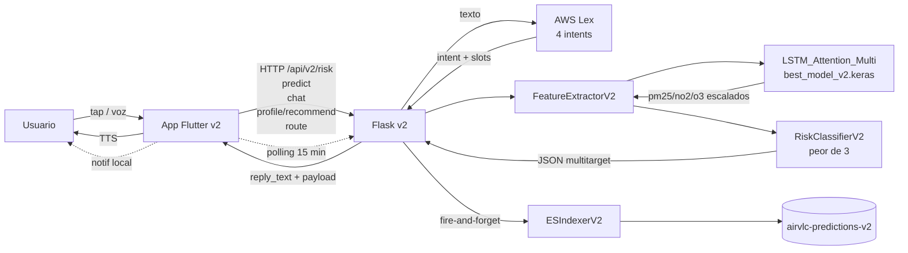

# Sprint 4 — App Flutter v2 (multitarget + diferencial)

> Versión expandida y persistida del [plan operativo](../../../.cursor/plans/sprint_4_flutter_v2_a01655f3.plan.md). Esta es la fuente canónica del Sprint 4.

## 1. Objetivo

Pasar de "modelo + API" a **producto real, usable y diferencial** en mano del ciudadano.

La app Flutter v2 cierra el ciclo end-to-end:

1. **Personaliza** la recomendación con el perfil de salud del usuario.
2. **Ayuda a tomar decisiones**: ruta más saludable, ¿salgo a correr?, ¿abro la ventana?
3. **Avisa proactivamente** cuando la calidad cambia (alertas suscritas).
4. **Funciona manos libres** (voz extremo a extremo: STT móvil → Flask → Lex → TTS móvil).
5. **Compara estaciones** dentro de la app.

Plataformas objetivo: **iOS y Android**.

## 2. Decisiones arquitectónicas

| Decisión | Por qué |
|---|---|
| **AWS solo en backend, nunca en el móvil** | Cuenta educativa con `AWS_SESSION_TOKEN` que caduca cada 3-4 h. Cognito en cliente no es viable. El móvil solo habla con `http://<host>:5001/api/v2/*`. |
| **`app/lib/` se construye desde cero** | El scaffolding existente solo contenía `main.dart` con un único `ChatScreen`. Sprint 4 reorganiza en `core/` + `features/`. |
| **Estado del usuario en el móvil** (`SharedPreferences`) | Privacidad/RGPD: el backend nunca persiste perfil ni suscripciones. |
| **3 intents Lex nuevos sin reentrenar** | Se añaden manualmente en consola de Lex y se da `Build`. El backend solo cambia el orquestador. |
| **Comparador y ruta sin routing real** | Determinismo de demo. Heurística sobre las 7 estaciones del CSV v2 = trade-off real PM2.5 vs NO₂ vs O₃. |

## 3. Funcionalidades diferenciales

### F1. Modo Salud Personal (estrella)

Onboarding + ajustes que recogen:
- **Edad**: niño / adulto / mayor de 65.
- **Condición**: sano / asma / EPOC / embarazada / cardiopatía.
- **Sensibilidad**: alta / media / baja.
- **Actividad típica**: sedentario / paseo diario / corredor / ciclista.

Estos campos modulan los **umbrales** que la UI usa para colorear los contaminantes (no cambia el modelo, cambia la **interpretación**).

Persistencia: `SharedPreferences` (`profile_storage.dart`).

### F2. Planificador de Ruta Saludable

Usuario elige **origen** y **destino** entre las 7 estaciones del v2. La app llama a `POST /api/v2/route`. El backend ordena los tramos por proximidad geográfica usando `STATION_COORDS` y devuelve el ICA esperado de cada tramo (`predictions` + `worst`).

La app pinta una barra horizontal coloreada y narra "Ruta saludable: pasa por Viveros (bueno) en lugar de Pista de Silla (malo NO₂)".

### F3. Alertas Suscritas (push local)

Pantalla "Mis alertas". Reglas tipo:
- *Avísame si Universidad Politécnica pasa a malo*.
- *Avísame si NO₂ supera 100 en Pista de Silla*.

Polling cada 15 min cuando la app está abierta + pull-to-refresh manual. Si la regla se cumple, dispara una notificación local (`flutter_local_notifications`).

Persistencia: `SharedPreferences` (`subscriptions_storage.dart`).

### F4. Modo Voz Manos Libres

Pantalla pantalla-completa con un único botón "Habla":

1. `speech_to_text` (móvil) graba y transcribe a texto.
2. `POST /api/v2/chat` con el texto. Lex en backend resuelve la intent.
3. La respuesta (`reply` o `reply_text`) se pasa a `flutter_tts`.

Pensado para conducción y personas mayores. Si la intent es `ConsejoSalud` la app pinta también el card de recomendación adaptada al perfil.

### F5. Comparador de Estaciones (in-app)

Dos columnas (Estación A vs Estación B) y un slider temporal "ahora / hace 6 h / hace 24 h". La app llama a `/api/v2/risk` para cada lado y pinta los 3 contaminantes.

## 4. Intents Lex nuevos (3)

Mantenemos `ConsultarCalidad`. Se añaden:

- **`ConsultarContaminante`** — slots: `Estacion`, `Contaminante` (`pm25` / `no2` / `o3`).
- **`CompararEstaciones`** — slots: `EstacionA`, `EstacionB`.
- **`ConsejoSalud`** — slots: `Estacion`, `Actividad` (`correr` / `pasear` / `pasear al perro` / `ir en bici` / `quedarme en casa`).

Detalles operativos (utterances + Build) en [`aws_keys_setup.md`](aws_keys_setup.md).

## 5. Cambios en el backend

Todos van bajo `/api/v2/*`, manteniendo intactos los endpoints actuales:

### `POST /api/v2/profile/recommend` (nuevo)

```json
{
  "station": "Politécnico",
  "activity": "correr",
  "profile": {
    "age": "adulto",
    "condition": "asma",
    "sensitivity": "alta"
  }
}
```

→ llama internamente a la inferencia v2 (igual que `/api/v2/risk`) y aplica un mapper "perfil → recomendación humanizada".

Output:

```json
{
  "success": true,
  "station": "Universidad Politécnica",
  "predictions": {"pm25": 14.0, "no2": 75.0, "o3": 110.0, "unit": "µg/m³"},
  "worst": {"pollutant": "no2", "level": "moderado", ...},
  "recommendation_text": "Con asma y sensibilidad alta, evita correr al aire libre en Universidad Politécnica: el NO₂ está en moderado.",
  "color": "#F4A300"
}
```

### `POST /api/v2/route` (nuevo)

```json
{ "from_station": "Francia", "to_station": "Universidad Politécnica" }
```

→ devuelve los tramos intermedios ordenados por proximidad geográfica usando coordenadas de `STATION_COORDS`. Mismo cuerpo `[{station, predictions, worst}]` que `/api/v2/risk` pero en lista.

### `POST /api/v2/chat` (existente, ampliado)

`ChatbotOrchestratorV2` añade ramas para los 3 intents nuevos. Reutiliza `RiskClassifierV2` y `FeatureExtractorV2`.

## 6. Estructura del proyecto Flutter

```
app/lib/
  main.dart                          # bootstrap + theme
  app.dart                           # MaterialApp + bottom nav (Dashboard / Chat / Voz / Perfil)
  core/
    api/
      airvlc_api_client.dart         # cliente HTTP /api/v2/*
      models/
        prediction.dart              # PM2.5/NO2/O3 + worst
        risk_level.dart              # bueno/moderado/malo/peligroso
        pollutant_reading.dart       # value + level + color
        route_segment.dart
        chat_response.dart
    storage/
      profile_storage.dart           # SharedPreferences (F1)
      subscriptions_storage.dart     # SharedPreferences (F3)
    notifications/
      local_notifications.dart       # flutter_local_notifications (F3)
    voice/
      stt_service.dart               # speech_to_text (F4)
      tts_service.dart               # flutter_tts (F4)
    theme/
      airvlc_theme.dart              # paleta accesible
    constants/
      api_constants.dart             # baseUrl
      stations.dart                  # 7 estaciones v2
  features/
    dashboard/
      dashboard_screen.dart
      pollutant_card.dart
    profile/
      onboarding_screen.dart
      profile_screen.dart
    route_planner/
      route_planner_screen.dart
    subscriptions/
      subscriptions_screen.dart
      add_rule_screen.dart
    voice_mode/
      voice_mode_screen.dart
    chat/
      chat_screen.dart
    stations_compare/
      compare_screen.dart
```

`pubspec.yaml` añade a las ya declaradas (`http`, `speech_to_text`, `flutter_tts`):

- `flutter_local_notifications` (F3)
- `shared_preferences` (F1, F3)
- `intl` (formato de fechas)
- `permission_handler` (micro y notificaciones)

## 7. Flujo end-to-end



## 8. Criterios de aceptación

- [ ] App Flutter compila para **iOS y Android** (`flutter build apk` y `flutter build ios --no-codesign`).
- [ ] Onboarding lee/escribe el perfil y persiste tras reinicio (F1).
- [ ] Dashboard muestra los 3 contaminantes con color adaptado al perfil (F1).
- [ ] Pantalla de ruta resuelve A→B con al menos 2 tramos coloreados (F2).
- [ ] Suscripción a regla "X pasa a malo" dispara notificación local cuando el backend lo confirma (F3).
- [ ] Modo voz funciona end-to-end: voz del usuario → respuesta hablada con `reply_text` correcto (F4).
- [ ] Comparador devuelve los dos paneles con slider temporal (F5).
- [ ] Los 3 nuevos intents Lex responden a ≥3 utterances cada uno.
- [ ] Backend mantiene 100% retro-compatibilidad: `/api/predict`, `/api/risk`, `/api/chat` v1 y `/api/v2/*` previos siguen idénticos.
- [ ] Documentación: 4 markdowns nuevos en `docs/v2AirVLCdocs/sprint4/`.
- [ ] `pytest -q` en verde (incluidos `/api/v2/route` y `/api/v2/profile/recommend`).

## 9. Riesgos y mitigaciones

| Riesgo | Mitigación |
|---|---|
| Token AWS caduca a media demo | Banner "voz desactivada" en la app; reminder al inicio de `aws_keys_setup.md`. |
| `speech_to_text` no funciona en simulador iOS | Demo de voz en dispositivo físico; el simulador prueba el resto. |
| Permisos Android (`POST_NOTIFICATIONS` API 33+) | Solicitar runtime con `permission_handler`; fallback con banner si se rechaza. |
| Latencia LSTM en M1/M2 | Validada en Sprint 3 (~250 ms). En móvil suma 50-150 ms de red local — bajo 500 ms total. |
| `ConsejoSalud` sin `profile` | Backend devuelve recomendación genérica. Nunca falla. |
