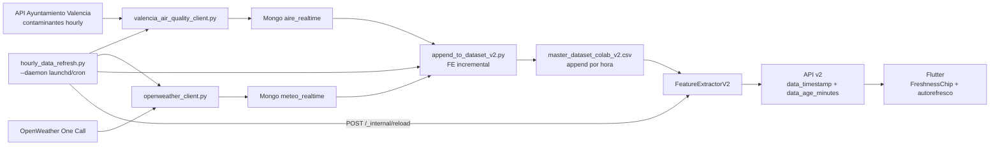

# Sprint 5 — Walkthrough

> Fecha de ejecución: 7 mayo 2026
> Duración: ~30 min (implementación + tests)

---

## 1. Contexto

El Sprint 5 transforma AirVLC de un sistema de "predicción sobre dataset estático" a uno con **datos refrescados cada hora**. Antes de este sprint, la API v2 cargaba el CSV una vez al arrancar y nunca más. El usuario no sabía si los datos eran de hace 5 minutos o de hace 3 meses.

## 2. Cambios Realizados

### 2.1 Fase A — Backend: frescura de datos

**`FeatureExtractorV2` (`src/api/feature_extractor_v2.py`)**

```diff
- def get_features(self, station_name: str) -> Tuple[np.ndarray, str]:
+ def get_features(self, station_name: str) -> Tuple[np.ndarray, str, dict]:
```

Ahora devuelve un dict `meta` con:
- `data_timestamp`: ISO timestamp de la última fila del CSV usada
- `data_window_start`: inicio de la ventana de 24h
- `data_age_minutes`: antigüedad en minutos

Se añadió `reload()` para recargar el CSV en caliente.

**`routes_v2.py` (`src/api/routes_v2.py`)**

Todos los endpoints ahora incluyen `server_timestamp` (cuándo respondió Flask) y, cuando se usa el extractor (no features directos), `data_timestamp`, `data_age_minutes` y `data_window_start`.

Nuevo endpoint: `POST /api/v2/_internal/reload` protegido por header `X-Internal-Token`.

### 2.2 Fase B — Pipeline de ingesta horaria

**B.1 — Valencia Air Quality Client (`src/ingestion/valencia_air_quality_client.py`)**
- Descarga contaminantes de la API Opendatasoft del Ayuntamiento de Valencia
- Normaliza nombres de estación al canónico del CSV v2
- Upsert idempotente en MongoDB `airvlc_db.aire_realtime`

**B.2 — Append incremental (`src/ml/append_to_dataset_v2.py`)**
- Lee solo la cola del CSV (48h por estación) — no recalcula todo
- Cruza con datos nuevos de Mongo (aire + meteo)
- Recalcula features incrementales (lags, rolling, trig, booleans)
- Append al CSV con `mode='a', header=False`

**B.3 — Scheduler (`src/scripts/hourly_data_refresh.py`)**

```
python src/scripts/hourly_data_refresh.py --once     # manual
python src/scripts/hourly_data_refresh.py --daemon    # persistente
```

Pipeline de 4 pasos:
1. `fetch_valencia_air_quality()` — B.1
2. `ingest_current_weather()` — OpenWeather existente
3. `append_to_dataset_v2()` — B.2
4. `POST /api/v2/_internal/reload` — B.4

### 2.3 Fase C — Flutter

**C.1 — Modelo `Prediction`** ampliado con campos de frescura.

**C.2 — Widget `FreshnessChip`**
- Texto: "Datos hasta 12:00 — hace 17 min"
- Color: verde (<90 min), ámbar (90-180 min), rojo (>180 min)
- Subtítulo: "Próxima actualización ~HH:00"
- Spinner mientras se refresca

**C.3 — `RefreshScheduler`**
- Timer.periodic cada minuto
- Dispara refresco si hora cambió o `dataAgeMinutes > 70`
- Observer `AppLifecycleState.resumed`
- Integrado en `DashboardScreen`

## 3. Resultados de Tests

```
============================= test session starts ==============================
collected 25 items

tests/api/test_v2_data_freshness.py::TestDataFreshness::test_predict_includes_freshness PASSED
tests/api/test_v2_data_freshness.py::TestDataFreshness::test_risk_includes_freshness PASSED
tests/api/test_v2_data_freshness.py::TestDataFreshness::test_predict_direct_features_no_freshness PASSED
tests/api/test_v2_data_freshness.py::TestDataFreshness::test_server_timestamp_is_recent PASSED
tests/api/test_v2_data_freshness.py::TestReloadEndpoint::test_reload_without_token_returns_403 PASSED
tests/api/test_v2_data_freshness.py::TestReloadEndpoint::test_reload_with_wrong_token_returns_403 PASSED
tests/api/test_v2_data_freshness.py::TestReloadEndpoint::test_reload_with_correct_token_returns_200 PASSED
tests/ingestion/test_valencia_client.py::TestNormalizeStation::test_canonical_match PASSED
tests/ingestion/test_valencia_client.py::TestNormalizeStation::test_known_aliases PASSED
tests/ingestion/test_valencia_client.py::TestNormalizeStation::test_case_insensitive PASSED
tests/ingestion/test_valencia_client.py::TestNormalizeStation::test_unknown_returns_none PASSED
tests/ingestion/test_valencia_client.py::TestNormalizeStation::test_all_valid_stations_recognized PASSED
tests/ingestion/test_valencia_client.py::TestParseRecords::test_valid_records_parsed PASSED
tests/ingestion/test_valencia_client.py::TestParseRecords::test_station_names_canonical PASSED
tests/ingestion/test_valencia_client.py::TestParseRecords::test_contaminants_are_float PASSED
tests/ingestion/test_valencia_client.py::TestParseRecords::test_comma_decimal_parsed PASSED
tests/ingestion/test_valencia_client.py::TestParseRecords::test_idempotent PASSED
tests/ml/test_append_to_dataset_v2.py::TestComputeFeatures::test_temporal_columns_created PASSED
tests/ml/test_append_to_dataset_v2.py::TestComputeFeatures::test_lags_computed PASSED
tests/ml/test_append_to_dataset_v2.py::TestComputeFeatures::test_rolling_computed PASSED
tests/ml/test_append_to_dataset_v2.py::TestComputeFeatures::test_lag1_equals_shifted_value PASSED
tests/ml/test_append_to_dataset_v2.py::TestComputeFeatures::test_lag24_equals_shifted_24h PASSED
tests/ml/test_append_to_dataset_v2.py::TestComputeFeatures::test_rolling_24h_is_mean_of_last_24 PASSED
tests/ml/test_append_to_dataset_v2.py::TestComputeFeatures::test_trig_encoding_range PASSED
tests/ml/test_append_to_dataset_v2.py::TestComputeFeatures::test_fallas_flag PASSED

============================== 25 passed in 2.07s ==============================
```

## 4. Diagrama de Flujo Final



## 5. Por qué este plan no obliga a reentrenar el modelo

El modelo `LSTM_Attention_Multi` recibe siempre `(1, 24, 44)` features escaladas con el mismo `scaler_v2.pkl`. Mientras las nuevas filas tengan los mismos 44 features y se respeten los rangos de entrenamiento (escalado MinMax tolera valores cercanos), no hay drift inmediato. Reentrenar quedaría para un Sprint 6 cuando tengamos suficiente histórico nuevo.

## 6. Degradación elegante

Si el scheduler está caído:
- La API sigue funcionando con los últimos datos disponibles
- `data_age_minutes` crecerá progresivamente
- El `FreshnessChip` en la app pasará de verde → ámbar → rojo
- El usuario ve la degradación sin que la app deje de funcionar
