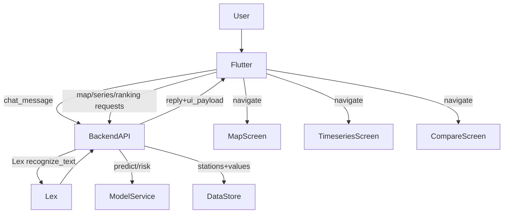

# Sprint 7 — Implementación Completa ✅

## Resumen

Implementación del Sprint 7: **Visualizaciones + Chatbot "con vida"** (mapa heatmap + forecast 24–72h).

---

## 🔧 Cambios Realizados

### Backend (Python/Flask)

| Archivo | Cambio |
|---------|--------|
| [routes_v2.py](file:///Users/miguel/Desktop/Curso%20IA/Propuesta%20Proyecto/AirVLCProyecto/src/api/routes_v2.py) | 3 nuevos endpoints: `/api/v2/map`, `/api/v2/timeseries`, `/api/v2/ranking` |
| [chatbot_orchestrator_v2.py](file:///Users/miguel/Desktop/Curso%20IA/Propuesta%20Proyecto/AirVLCProyecto/src/services/chatbot_orchestrator_v2.py) | `ui_payload` en todos los intents + handlers para `VerMapaRiesgo` y `PrevisionRiesgo` |

#### Nuevos Endpoints
- **`GET /api/v2/map?pollutant=pm25&horizon=0`** → Todas las estaciones con valor/riesgo para el mapa
- **`GET /api/v2/timeseries?station=Francia&pollutant=pm25`** → Últimas 72h observadas + forecast 0/24/48/72h
- **`GET /api/v2/ranking?pollutant=pm25&horizon=0&top=7`** → Top N estaciones por riesgo

#### ui_payload (Chat)
Cada respuesta del chatbot ahora incluye:
```json
{
  "ui_payload": {
    "action": "open_map | open_station_detail | open_comparison | open_advice",
    "station": "...",
    "pollutant": "pm25",
    "horizon": "now | 24 | 48 | 72"
  }
}
```

### Flutter (Dart)

| Archivo | Cambio |
|---------|--------|
| [pubspec.yaml](file:///Users/miguel/Desktop/Curso%20IA/Propuesta%20Proyecto/AirVLCProyecto/app/pubspec.yaml) | Añadido `fl_chart: ^0.69.0` |
| [api_constants.dart](file:///Users/miguel/Desktop/Curso%20IA/Propuesta%20Proyecto/AirVLCProyecto/app/lib/core/constants/api_constants.dart) | Nuevas URLs: map, timeseries, ranking |
| [stations.dart](file:///Users/miguel/Desktop/Curso%20IA/Propuesta%20Proyecto/AirVLCProyecto/app/lib/core/constants/stations.dart) | Coordenadas geográficas de las 7 estaciones |
| [airvlc_api_client.dart](file:///Users/miguel/Desktop/Curso%20IA/Propuesta%20Proyecto/AirVLCProyecto/app/lib/core/api/airvlc_api_client.dart) | Métodos `mapStations()`, `timeseries()`, `ranking()` |
| [chat_response.dart](file:///Users/miguel/Desktop/Curso%20IA/Propuesta%20Proyecto/AirVLCProyecto/app/lib/core/api/models/chat_response.dart) | Nuevo `ChatUiPayload` model |
| [map_risk_screen.dart](file:///Users/miguel/Desktop/Curso%20IA/Propuesta%20Proyecto/AirVLCProyecto/app/lib/features/map/map_risk_screen.dart) | **NUEVA** — Mapa esquemático con markers animados |
| [timeseries_screen.dart](file:///Users/miguel/Desktop/Curso%20IA/Propuesta%20Proyecto/AirVLCProyecto/app/lib/features/timeseries/timeseries_screen.dart) | **NUEVA** — Gráfico observado vs forecast con fl_chart |
| [chat_screen.dart](file:///Users/miguel/Desktop/Curso%20IA/Propuesta%20Proyecto/AirVLCProyecto/app/lib/features/chat/chat_screen.dart) | Botones CTA desde `ui_payload` (navega a mapa/serie/comparación) |
| [app.dart](file:///Users/miguel/Desktop/Curso%20IA/Propuesta%20Proyecto/AirVLCProyecto/app/lib/app.dart) | 5 tabs: Inicio, **Mapa**, Chat, Alertas, Perfil |
| [dashboard_screen.dart](file:///Users/miguel/Desktop/Curso%20IA/Propuesta%20Proyecto/AirVLCProyecto/app/lib/features/dashboard/dashboard_screen.dart) | Quick actions: "Mapa de riesgo" y "Serie temporal" |

### Transparencia UX

- **Badge freshness** en el bottom sheet del mapa: "Dato actual" vs "Forecast +Xh"
- **Banner de modelo** en el timeseries: "R²≈0.86, tendencia, no valor exacto"
- **Disclaimer RMSE** en freshness info: "±3–9 µg/m³"
- **PrevisionRiesgo** intent: "⚠️ El modelo predice tendencia, no valor exacto."

### Documentación

| Archivo | Contenido |
|---------|-----------|
| [kibana_dashboard_setup.md](file:///Users/miguel/Desktop/Curso%20IA/Propuesta%20Proyecto/AirVLCProyecto/docs/v2AirVLCdocs/sprint7/kibana_dashboard_setup.md) | Guía paso a paso para crear el dashboard en Kibana |
| [lex_new_intents.md](file:///Users/miguel/Desktop/Curso%20IA/Propuesta%20Proyecto/AirVLCProyecto/docs/v2AirVLCdocs/sprint7/lex_new_intents.md) | Intents, slots y utterances para crear en la consola de Lex |

---

## ⚠️ Acciones Manuales Necesarias

> [!IMPORTANT]
> Estas acciones requieren intervención manual:

### 1. Reiniciar Flask API
```bash
# Parar el servidor actual y arrancarlo de nuevo
python src/api/app.py
```

### 2. Crear Intents en AWS Lex (consola)
Sigue la guía en [lex_new_intents.md](file:///Users/miguel/Desktop/Curso%20IA/Propuesta%20Proyecto/AirVLCProyecto/docs/v2AirVLCdocs/sprint7/lex_new_intents.md):
- Crear `VerMapaRiesgo` con slot opcional `Contaminante`
- Crear `PrevisionRiesgo` con slots `Estacion`, `Contaminante`, `Horizonte`
- **Build** del bot después de añadir los intents

### 3. Actualizar credenciales AWS
Actualizar en `.env`:
- `AWS_ACCESS_KEY_ID`
- `AWS_SECRET_ACCESS_KEY`
- `AWS_SESSION_TOKEN`

### 4. Crear Dashboard en Kibana
Sigue la guía en [kibana_dashboard_setup.md](file:///Users/miguel/Desktop/Curso%20IA/Propuesta%20Proyecto/AirVLCProyecto/docs/v2AirVLCdocs/sprint7/kibana_dashboard_setup.md):
- Crear data view `airvlc-predictions-v2`
- Crear los 6 paneles del dashboard

### 5. Arrancar Flutter
```bash
cd app && flutter run
```

---

## 🏗️ Arquitectura Sprint 7


